---
lab:
  title: ラボ 1 - Azure portal と SQL Server Management Studio の使用
  module: The Role of the Azure Database Administrator
---


# <a name="lab-1---using-the-azure-portal-and-sql-server-management-studio"></a>ラボ 1 - Azure portal と SQL Server Management Studio の使用

**推定所要時間:30 分**

**前提条件:なし** 

**ラボ ファイル:なし**

 

# <a name="lab-overview"></a>ラボの概要 

Students will explore the Azure Portal and use it to create an Azure VM with SQL Server 2019 installed. Then they will connect to the virtual machine through Remote Desktop Protocol and restore a database using SQL Server Management Studio. 

# <a name="lab-goal"></a>ラボの目標

The student will be able to interact with the Azure portal to create a SQL Server Virtual Machine. They should then be able to connect to the virtual machine and use SQL Server Management Studio to restore a database. 

# <a name="lab-objectives"></a>ラボの目的

受講者は以下のことができるようになります。

- Azure portal を操作する

- SQL Server 仮想マシンを作成する

- SQL Server Management Studio を使用してデータベースを復元する

# <a name="scenario"></a>シナリオ

You are a database administrator for AdventureWorks. You need to create a test environment for use in a proof of concept. The proof of concept will use SQL Server on an Azure Virtual Machine and a backup of the AdventureWorksDW database. You need to set up the Virtual Machine, restore the database, and query it to ensure it is available. 

# <a name="exercise-1-provision-a-sql-server-on-an-azure-virtual-machine"></a>演習 1:Azure 仮想マシンで SQL Server をプロビジョニングする

**推定所要時間:20 分**

この演習の主なタスクは次のとおりです。 

1. Azure portal を調べて、重要な機能を見つけます。

2. Azure ortal を使用して、Azure Virtual Machine 上に SQL Server を作成します。

 

## <a name="task-1-explore-the-azure-portal"></a>タスク 1:Azure portal をを探索する

1. まだポータルを開いていない場合は、ラボの仮想マシンからブラウザー セッションを開始し、[https://portal.azure.com](https://portal.azure.com/) に移動します。 

    

 

2. In the Azure Portal, type subscription in the search bar at the top of the screen. Click on the subscriptions icon. (You may need to log in first.)

    

 

3. On the Subscriptions blade, you will have one or more subscriptions. Review your Subscription name, subscription ID, and your role. 

    

4. Launch the left navigation pane by clicking the horizontal lines next to Microsoft Azure in the top left of the portal. Then select All resources. 

    

    

 

5. [すべてのリソース] ページには、選択したサブスクリプション内のすべての Azure リソースが一覧表示されます。 

 

6. 左側のナビゲーションで [リソース グループ] を選択します。

    

    

    [リソース グループ] ブレードには、選択したサブスクリプション内のすべての Azure リソースグループが一覧表示されます。 


7. [リソースグループ] ブレードで、[作成] ボタンを選択します。 

    

 
8. Ensure you have selected the appropriate subscription for the lab. Name the resource group DP-300-Lab01. Select the nearest Azure region to your location. Select the Review + Create button. Once the review completes, select the Create button. 

    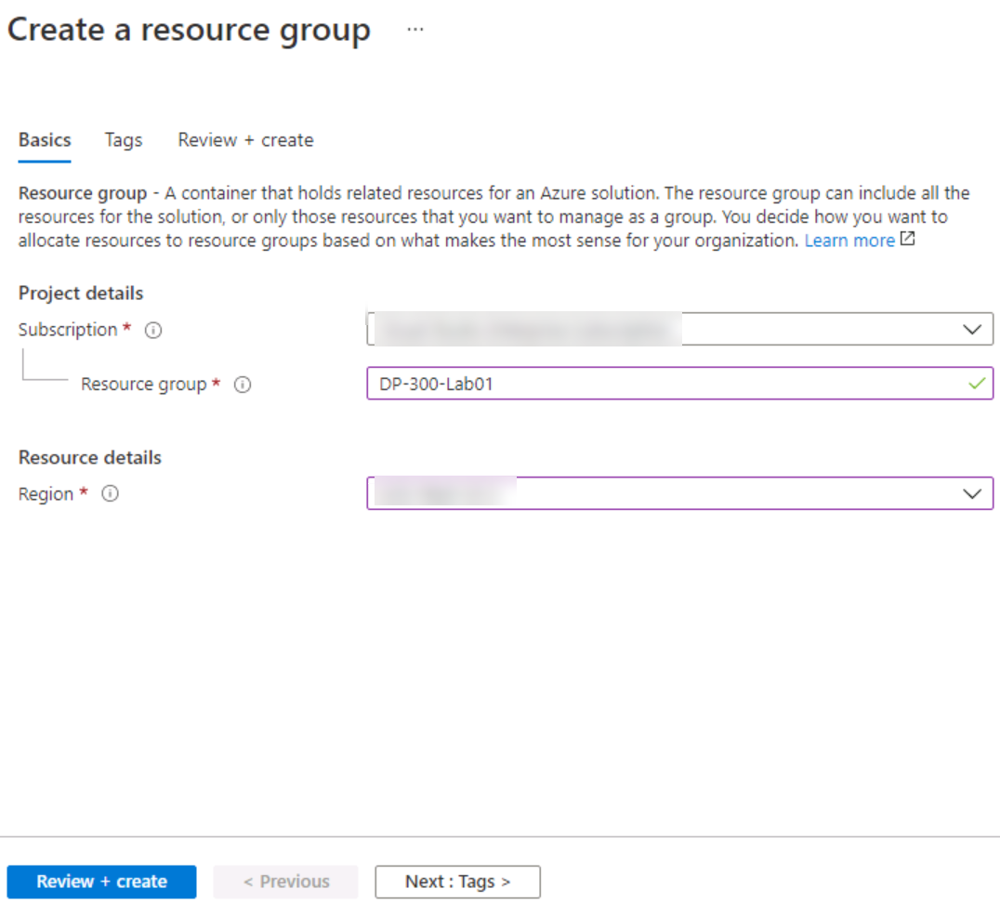

9. 受講生は Azure portal を探索し、それを使用して SQL Server 2019 がインストールされた Azure VM を作成します。

    

 

## <a name="task-2-provision-a-sql-server-on-an-azure-virtual-machine"></a>タスク 2:Azure 仮想マシンで SQL Server をプロビジョニングする

1. Azure SQL ブレードで、[作成] ボタンを選択します。 

    


2. 次に、リモート デスクトップ プロトコルを介して仮想マシンに接続し、SQL Server Management Studio を使用してデータベースを復元します。
    
    

3. [仮想マシンの作成] ブレードで、次の情報を入力します。 

    - [サブスクリプション]: **&lt;ご利用のサブスクリプション&gt;**

    - リソース グループ: **DP-300-Lab01**

    - 仮想マシン名:  **dp300sqlvmlab01**

    - リージョン: **&lt;リソース グループ用に選択されたリージョンと同じローカル リージョン&gt;**

    - [可用性オプション]: **[インフラストラクチャ冗長は必要ありません]**
    
    - イメージ:**無料 SQL Server ライセンス:Windows Server 2019 - Gen1 上の SQL 2019 Developer**

    - Azure スポット インスタンス:"**いいえ**"

    - サイズ:Standard **D2s_v3** (2 vCPU、8 GiB メモリ。このオプションを表示するには [すべてのサイズを表示] リンクを選択することが必要な場合があります)

    - 管理者アカウントのユーザー名: **dp300sqlvmlab01admin**

    - 管理者アカウントのパスワード: **pwd!DP300lab01** (または基準を満たす独自のパスワード)

    - 受信ポートを選択**RDP (3389)**

    - 既存の Windows サーバー ライセンスを使用しますか?"**いいえ**"

 

    ユーザー名とパスワードは後で使うためにメモしておきます。

    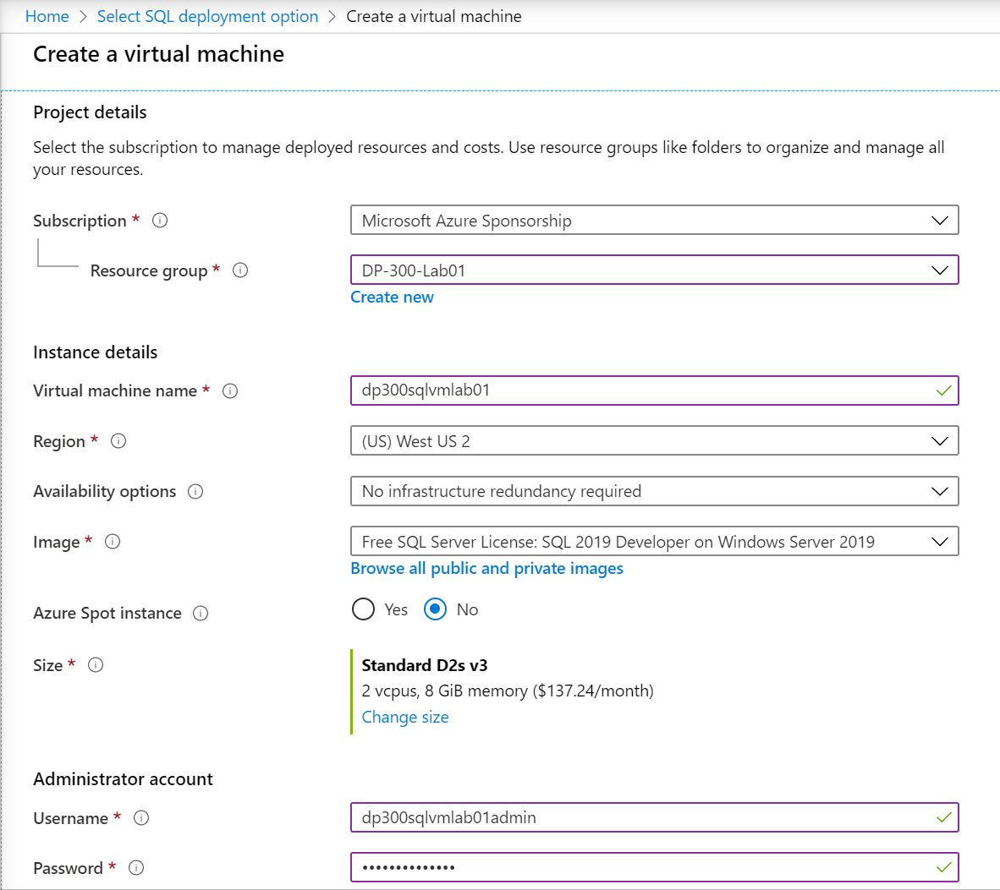


4. [ディスク] タブに移動し、構成を確認します。 

    

 
5. [ネットワーク] タブに移動し、構成を確認します。 

    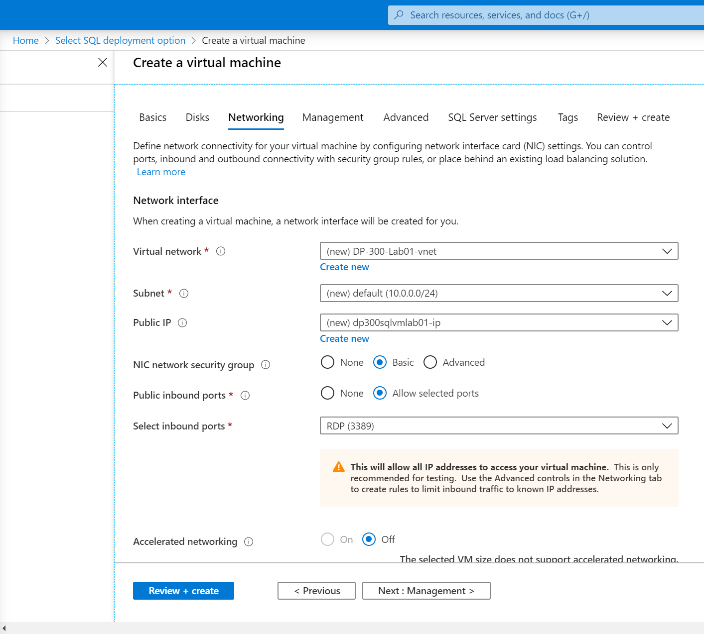
 

6. [管理] タブに移動し、構成を確認します。 

    

    Make sure that <bpt id="p1">**</bpt>Boot diagnostics<ept id="p1">**</ept> has the button for <bpt id="p2">**</bpt>Enable with managed storage account (recommended)<ept id="p2">**</ept> selected. 
    Verify that <bpt id="p1">**</bpt>Enable auto_shutdown<ept id="p1">**</ept> is off. 


7. [詳細] タブに移動し、構成を確認します。 

    


8. [SQL Server の設定] タブに移動し、構成を確認します。 

    

 

    Note—you can also configure the storage for your SQL Server VM on this screen. By default, the SQL Server Azure VM templates create one premium disk with read caching for data, one premium disk without caching for transaction log, and uses the local SSD (D:\ on Windows) for tempdb.


9. 受講生は Azure portal と対話して SQL Server 仮想マシンを作成できます。  
‎ 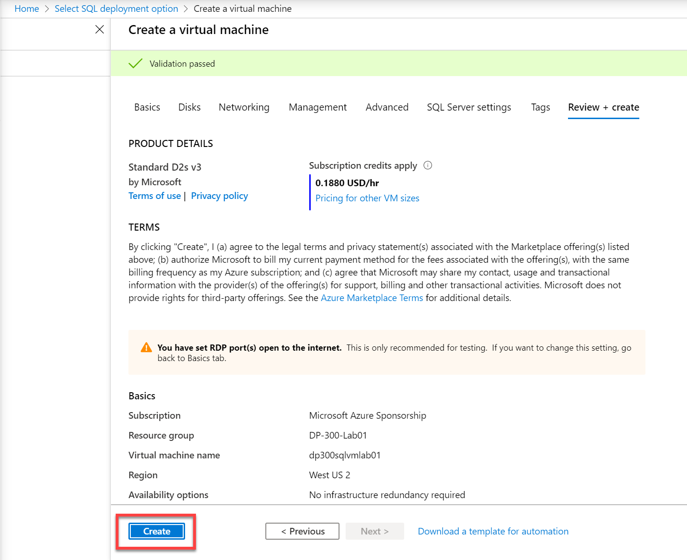


10. その後、仮想マシンに接続し、SQL Server Management Studio を使用してデータベースを復元できます。 

    

 
11. 仮想マシンの概要ページで、リソースのメニュー オプションをスクロールして、使用可能な内容を確認します。

    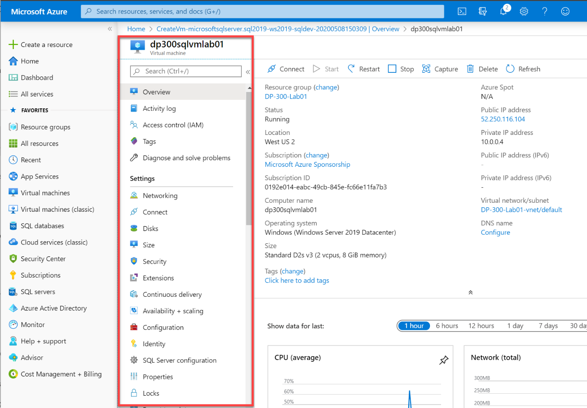


# <a name="exercise-2-connect-to-sql-server-and-restore-a-backup"></a>演習 2:SQL Server に接続してバックアップを復元する

**推定所要時間:10 分**

この演習の主なタスクは次のとおりです。 

1. Azure Virtual Machine で SQL Server への RDP（リモート デスクトップ プロトコル）接続を作成する

2. データベース バックアップ ファイルをダウンロードします。

3. SQL Server Management Studio を使用して SQL Server でデータベースを復元する

4. データベースをクエリして、その可用性を確認します

 
## <a name="task-1-connect-to-the-virtual-machine-and-download-the-backup-file"></a>タスク 1:仮想マシンに接続し、バックアップ ファイルをダウンロードします

1. 仮想マシンの概要ページで、[接続] ボタンを選択し、[RDP] を選択します。 

    

 
2. [RDP] タブで、[RDP ファイルのダウンロード] ボタンを選択します。 

    

3. Open the RDP file that was just downloaded. When a dialog appears asking if you want to connect, select the Connect button.   
‎   

 
4. In the Windows Security dialog if you receive the PIN dialog, select More choices. Then choose Use a different account. If you don’t receive the PIN dialog, you can proceed to Step 5.

    

 
5. Enter the username and password selected during the virtual machine provisioning process. Then select the OK button.

    

 
6. 接続するかどうかを尋ねる [リモート デスクトップ接続] ダイアログが表示されたら、[はい] ボタンを選択します。 

    


7. A Remote Desktop window will open. On the right, select the No button to indicate you do not want the computer to be discoverable by other devices on the network. Close the small Server Manager popup dialog by clicking the X in the top right of the box. Keep the big Server Manager Window open.

    

 
8. [サーバー マネージャー] ウィンドウで、左側の [ローカルサーバー] を選択し、[IE 強化されたセキュリティ構成] の横にある [オン] を選択します。 

    

 
9. When the Internet Explorer Enhanced Security Configuration dialog appears, set Administrators to Off. Then select the OK button.

    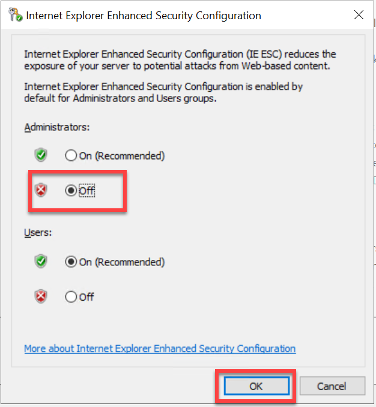

 
10. タスク バーからアイコンを選択して Internet Explorer を開きます。 

    


11. Internet Explorer で、次の URL に移動します。 

    [https://github.com/Microsoft/sql-server-samples/releases/download/adventureworks/AdventureWorksDW2017.bak](https://github.com/Microsoft/sql-server-samples/releases/download/adventureworks/AdventureWorksDW2017.bak)

    

    ファイルを実行するか保存するかを尋ねるダイアログが表示されます。   
    ‎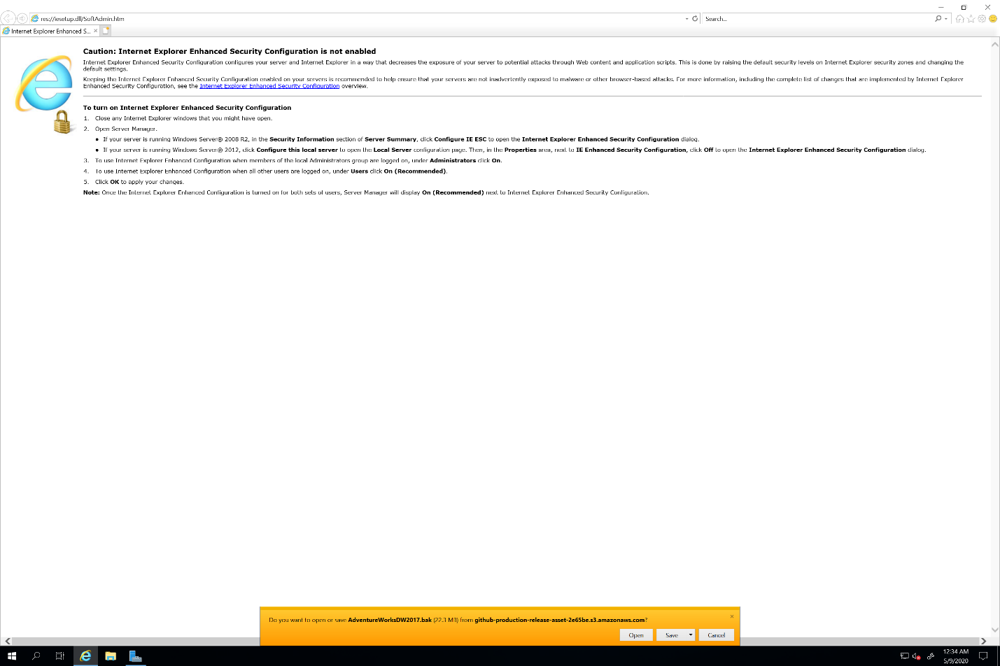

 

12. ダイアログで、[保存] の横のドロップダウンを選択し、[名前を付けて保存] を選択します。 

    

 

13. [名前を付けて保存] ダイアログで、次のフォルダーの場所に移動します。   
C:\Program Files\Microsoft SQL Server\MSSQL15.MSSQLSERVER\MSSQL\Backup.  
‎ Leave the file name as AdventureWorksDW2017 and the type as BAK file. Select the Save button. 

    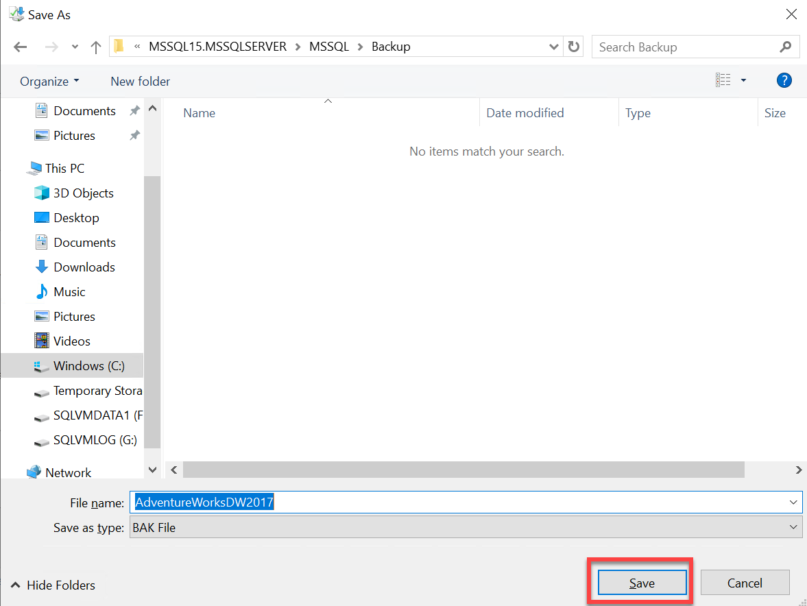
 
## <a name="task-2-restore-the-database-and-verify-its-availability"></a>タスク 2:データベースを復元し、その可用性を確認する

 

1. Select the Windows Start button and type SSMS. Select Microsoft SQL Server Management Studio 18 from the list.  
‎ 


2. あなたは、AdventureWorks のデータベース管理者です。 


    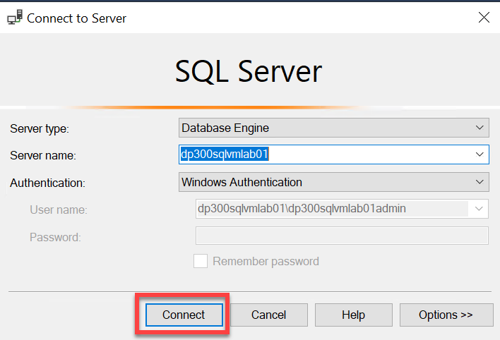

 

3. オブジェクト エクスプローラーで、[データベース] ノードを右クリックし、[データベースの復元] を選択します。

    

 

4. [データベースの復元] ダイアログの [ソース] で [デバイス] を選択し、省略記号の付いたデバイスの右側にあるボタンを選択します。 

    

 

5. [バックアップデバイスの選択] ダイアログで、[追加] を選択します。 

    


6. [ローカルバックアップファイル] ダイアログで、AdventureWorksDW2017.bak を選択し、[OK] ボタンを選択します。 

    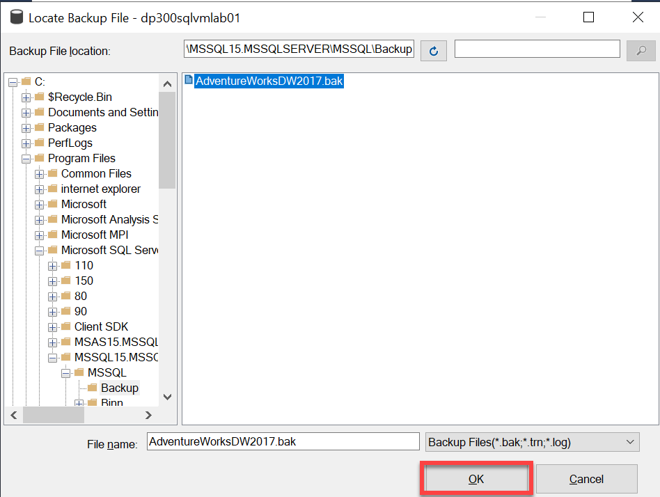

 
7. あなたは、概念実証で使用するためのテスト環境を作成する必要があります。

    


8. 概念実証では、Azure Virtual Machine で SQL Server を使用し、AdventureWorksDW データベースのバックアップを使用します。 

    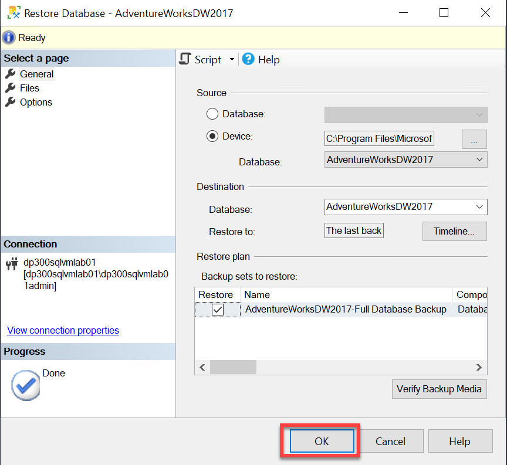

 
9. 仮想マシンをセットアップし、データベースを復元し、クエリを実行して、使用可能であることを確認する必要があります。

    

 

10. In the Object Explorer, expand the Databases node, then expand the AdventureWorksDW2017 node, then expand the Tables node. Verify that the database contains several tables including dbo.DimAccount.

    

 
11. In Management Studio, select the AdventureWorksDW2017 node in the Object Explorer. Then select the New Query button. 

    


12. 次のステートメントをコピーして、新しいクエリ ウィンドウに貼り付けます。 

    ```SQL
    SELECT CalendarYear, Sum(SalesAmount) SalesAmount 

    FROM dbo.FactInternetSales FS

    INNER JOIN dbo.DimDate DD ON FS.OrderDateKey = DD.DateKey

    GROUP BY CalendarYear
    ```

    


13. Select the Execute button execute the query. Verify that the sales amount for 2010 is <bpt id="p1">**</bpt>43421.0364<ept id="p1">**</ept>. 

    

 

 

## <a name="task-3-clean-up"></a>タスク 3:クリーンアップ

1. リモート デスクトップを終了します。 

2. Delete the VM you created in this lab to save costs. You will not be using it for subsequent labs. 

3. **dp300sqlvmlab01** 仮想マシンのメイン (概要) ブレードに移動し、メニューの [削除] ボタンをクリックします。 

    
 
4. **[OK]** をクリックします。
