---
lab:
  title: ラボ 1 - Azure portal と SQL Server Management Studio の使用
  module: The Role of the Azure Database Administrator
---


# <a name="lab-1---using-the-azure-portal-and-sql-server-management-studio"></a>ラボ 1 - Azure portal と SQL Server Management Studio の使用

**推定所要時間:30 分**

**前提条件:なし** 

**ラボ ファイル:なし**

 

# <a name="lab-overview"></a>ラボの概要 

受講生は Azure portal を探索し、それを使用して SQL Server 2019 がインストールされた Azure VM を作成します。 次に、リモート デスクトップ プロトコルを介して仮想マシンに接続し、SQL Server Management Studio を使用してデータベースを復元します。 

# <a name="lab-goal"></a>ラボの目標

受講生は Azure portal と対話して SQL Server 仮想マシンを作成できます。 その後、仮想マシンに接続し、SQL Server Management Studio を使用してデータベースを復元できます。 

# <a name="lab-objectives"></a>ラボの目的

受講者は以下のことができるようになります。

- Azure portal を操作する

- SQL Server 仮想マシンを作成する

- SQL Server Management Studio を使用してデータベースを復元する

# <a name="scenario"></a>シナリオ

あなたは、AdventureWorks のデータベース管理者です。 あなたは、概念実証で使用するためのテスト環境を作成する必要があります。 概念実証では、Azure Virtual Machine で SQL Server を使用し、AdventureWorksDW データベースのバックアップを使用します。 仮想マシンをセットアップし、データベースを復元し、クエリを実行して、使用可能であることを確認する必要があります。 

# <a name="exercise-1-provision-a-sql-server-on-an-azure-virtual-machine"></a>演習 1:Azure 仮想マシンで SQL Server をプロビジョニングする

**推定所要時間:20 分**

この演習の主なタスクは次のとおりです。 

1. Azure portal を調べて、重要な機能を見つけます。

2. Azure ortal を使用して、Azure Virtual Machine 上に SQL Server を作成します。

 

## <a name="task-1-explore-the-azure-portal"></a>タスク 1:Azure portal をを探索する

1. まだポータルを開いていない場合は、ラボの仮想マシンからブラウザー セッションを開始し、[https://portal.azure.com](https://portal.azure.com/) に移動します。 

    

 

2. Azure portal において、画面上部の検索バーに「サブスクリプション」と入力します。 サブスクリプション アイコンをクリックします。 (最初にログインが必要な場合があります。)

    

 

3. [サブスクリプション] ブレードには、1 つ以上のサブスクリプションがあります。 サブスクリプション名、サブスクリプション ID、および役割を確認します。 

    

4. ポータルの左上にある Microsoft Azure の横の水平線をクリックして、左側のナビゲーション ペインを起動します。 次に、[すべてのリソース] を選択します。 

    

    

 

5. [すべてのリソース] ページには、選択したサブスクリプション内のすべての Azure リソースが一覧表示されます。 

 

6. 左側のナビゲーションで [リソース グループ] を選択します。

    

    

    [リソース グループ] ブレードには、選択したサブスクリプション内のすべての Azure リソースグループが一覧表示されます。 


7. [リソースグループ] ブレードで、[作成] ボタンを選択します。 

    

 
8. ラボに適切なサブスクリプションを選択していることを確認してください。 リソース グループに DP-300-Lab01 という名前を付けます。 自分の場所に最も近い Azure リージョンを選択します。 [Review + create] ボタンを選択します。 確認が完了したら、[作成] ボタンを選択します。 

    

9. ページの上部にある検索バーを見つけます。 Azure SQL を検索します。 [サービス] の下の結果に表示される Azure SQL の検索結果を選択します。

    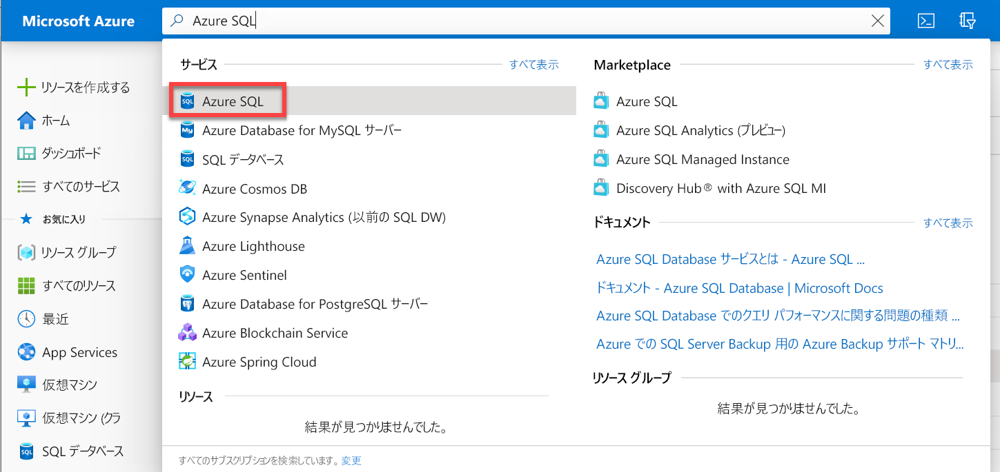

 

## <a name="task-2-provision-a-sql-server-on-an-azure-virtual-machine"></a>タスク 2:Azure 仮想マシンで SQL Server をプロビジョニングする

1. Azure SQL ブレードで、[作成] ボタンを選択します。 

    


1. [SQL デプロイ オプションを選択する] ブレードで、[SQL 仮想マシン] の下のドロップダウン ボックスを開きます。 **Free SQL Server License: SQL 2019 Developer on Windows Server 2019** というラベルの付いたオプションを選択して [作成] ボタンを選択します。
    
    

1. [仮想マシンの作成] ブレードで、次の情報を入力します。 

    - [サブスクリプション]: **&lt;ご利用のサブスクリプション&gt;**

    - リソース グループ: **DP-300-Lab01**

    - 仮想マシン名:  **dp300sqlvmlab01**

    - リージョン: **&lt;リソース グループ用に選択されたリージョンと同じローカル リージョン&gt;**

    - [可用性オプション]: **[インフラストラクチャ冗長は必要ありません]**
    
    - イメージ:**Free SQL Server License: SQL 2019 Developer on Windows Server 2019**

    - Azure スポット インスタンス:"**いいえ**"

    - サイズ:Standard **D2s_v3** (2 vCPU、8 GiB メモリ。このオプションを表示するには [すべてのサイズを表示] リンクを選択することが必要な場合があります)

    - 管理者アカウントのユーザー名: **dp300sqlvmlab01admin**

    - 管理者アカウントのパスワード: **pwd!DP300lab01** (または基準を満たす独自のパスワード)

    - 受信ポートを選択: **RDP (3389)**

    - 既存の Windows サーバー ライセンスを使用しますか?: "**いいえ**"

 

    ユーザー名とパスワードは後で使うためにメモしておきます。

    


1. [ディスク] タブに移動し、構成を確認します。 

    

 
1. [ネットワーク] タブに移動し、構成を確認します。 

    
 

1. [管理] タブに移動し、構成を確認します。 
    **[自動シャットダウンを有効にする]** がオフになっていることを確認します。 

    

1. [Monitoring] タブに移動し、構成を確認します。
    **[Boot diagnostics]** で **[Enable with managed storage account (recommended)]** が選択されていることを確認します。 


7. [詳細] タブに移動し、構成を確認します。 

    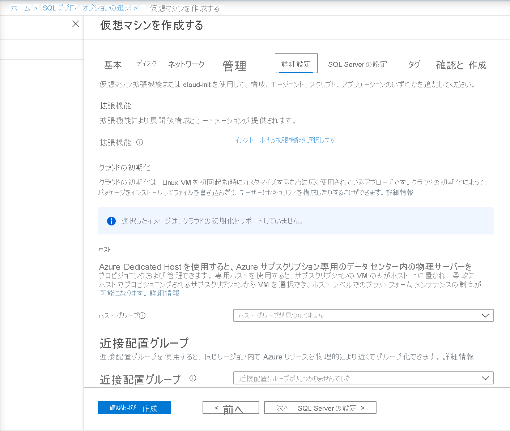


8. [SQL Server の設定] タブに移動し、構成を確認します。 

    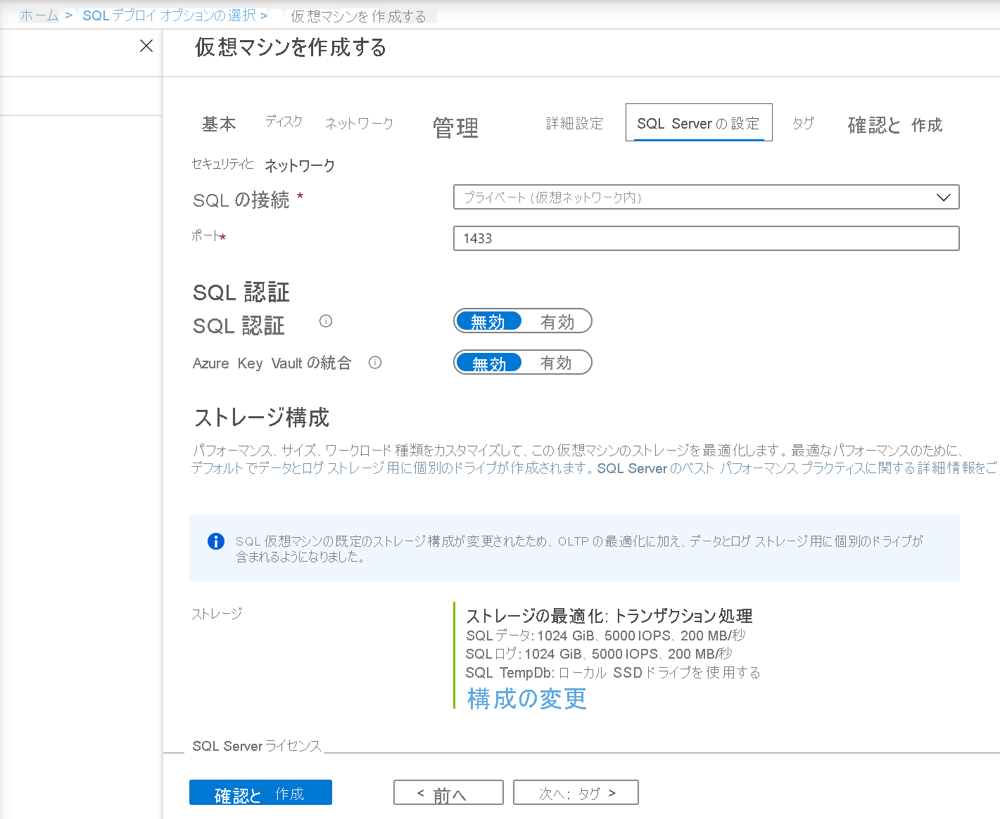

 

    注 - この画面では、SQL Server VM のストレージを構成することもできます。 既定では、SQL Server Azure VM テンプレートは、データの読み取りキャッシュ付きのプレミアム ディスクを1つ、トランザクションログのキャッシュなしのプレミアム ディスクを1つ作成し、tempdb にローカル SSD（Windows では D:\）を使用します。


9. [確認および作成] ボタンを選択します。 [作成] ボタンを選択します。  
‎ 


10. デプロイ ブレードで、デプロイが完了するまで待ちます。 VM のデプロイには約 5 - 10 分かかります。 次に、[リソースに移動] ボタンを選択します。 

    

 
11. 仮想マシンの概要ページで、リソースのメニュー オプションをスクロールして、使用可能な内容を確認します。

    


# <a name="exercise-2-connect-to-sql-server-and-restore-a-backup"></a>演習 2:SQL Server に接続してバックアップを復元する

**推定所要時間:10 分**

この演習の主なタスクは次のとおりです。 

1. Azure Virtual Machine で SQL Server への RDP（リモート デスクトップ プロトコル）接続を作成する

2. データベース バックアップ ファイルをダウンロードします。

3. SQL Server Management Studio を使用して SQL Server でデータベースを復元する

4. データベースをクエリして、その可用性を確認します

 
## <a name="task-1-connect-to-the-virtual-machine-and-download-the-backup-file"></a>タスク 1:仮想マシンに接続し、バックアップ ファイルをダウンロードします

1. 仮想マシンの概要ページで、[接続] ボタンを選択し、[RDP] を選択します。 

    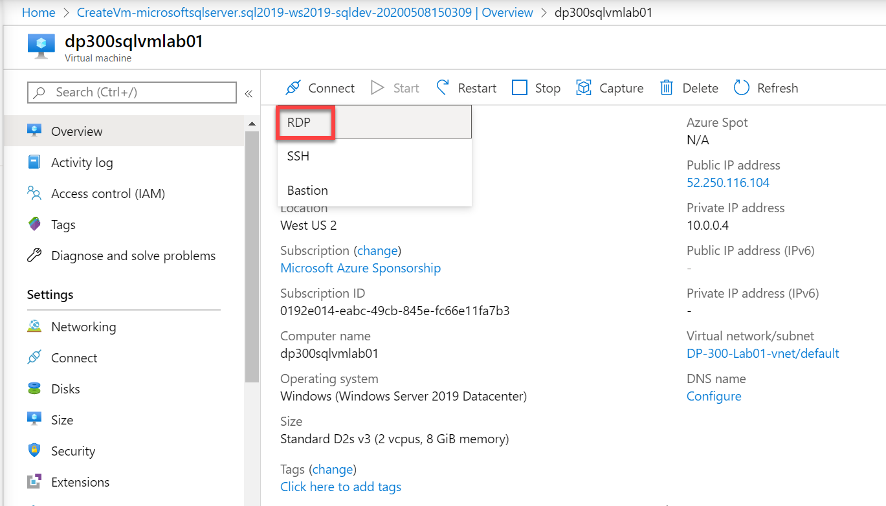

 
2. [RDP] タブで、[RDP ファイルのダウンロード] ボタンを選択します。 

    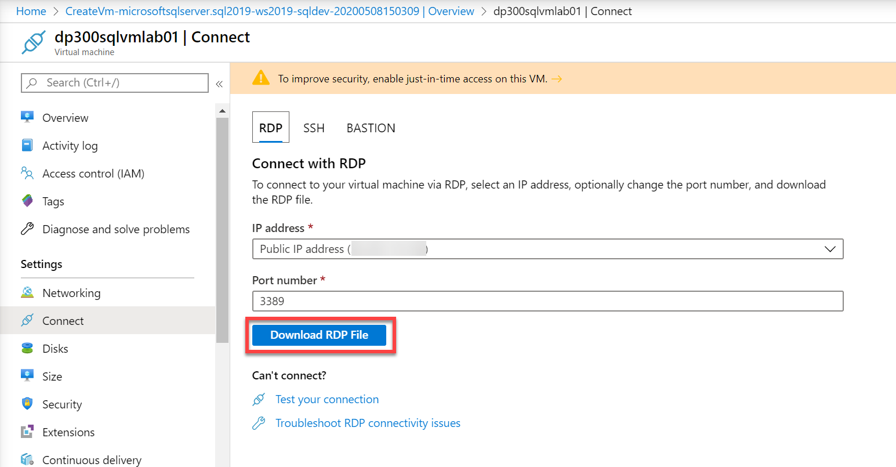

3. ダウンロードした RDP ファイルを開きます。 接続するかどうかを尋ねるダイアログが表示されたら、[接続] ボタンを選択します。   
‎   

 
4. [Windows セキュリティ] ダイアログで、[PIN] ダイアログを受け取ったら、[その他の選択肢] を選択します。 必ず別のアカウントを使用してください。 PIN ダイアログが表示されない場合は、ステップ 5 に進みます。

    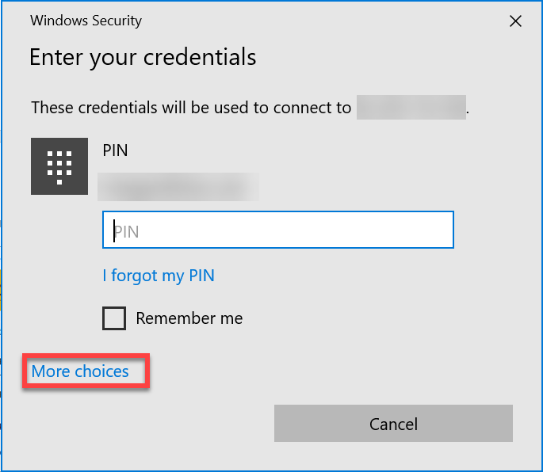

 
5. 仮想マシンのプロビジョニング プロセス中に選択したユーザー名とパスワードを入力します。 次に、[OK] ボタンを選択します。

    

 
6. 接続するかどうかを尋ねる [リモート デスクトップ接続] ダイアログが表示されたら、[はい] ボタンを選択します。 

    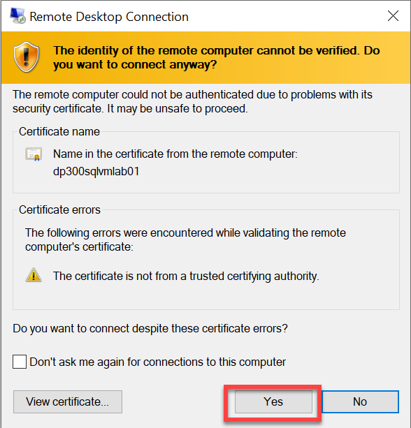


7. リモート デスクトップ ウィンドウが開きます。 右側にある [いいえ] ボタンを選択して、ネットワーク上の他のデバイスからコンピューターを検出できないように指定します。 ボックスの右上にある X をクリックして、小さいサーバー マネージャー ポップアップ ダイアログを閉じます。 サーバー マネージャー ウィンドウは開いたままにしておきます。

    

 
8. [サーバー マネージャー] ウィンドウで、左側の [ローカルサーバー] を選択し、[IE 強化されたセキュリティ構成] の横にある [オン] を選択します。 

    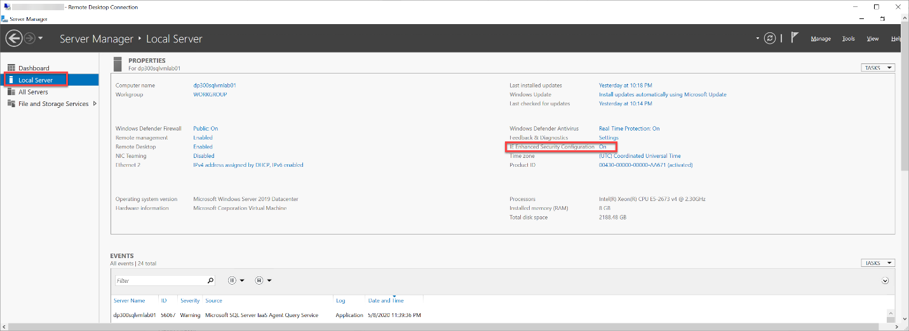

 
9. [Internet Explorer 強化されたセキュリティの構成] ダイアログが表示されたら、[管理者] を [オフ] に設定します。 次に、[OK] ボタンを選択します。

    

 
10. タスク バーからアイコンを選択して Internet Explorer を開きます。 

    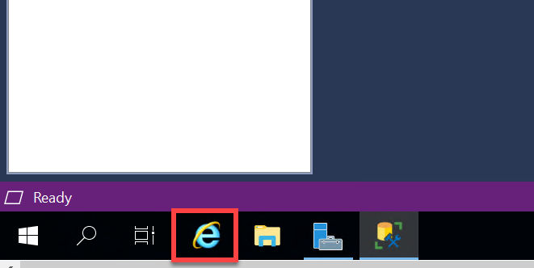


11. Internet Explorer で、次の URL に移動します。 

    [https://github.com/Microsoft/sql-server-samples/releases/download/adventureworks/AdventureWorksDW2017.bak](https://github.com/Microsoft/sql-server-samples/releases/download/adventureworks/AdventureWorksDW2017.bak)

    

    ファイルを実行するか保存するかを尋ねるダイアログが表示されます。   
    ‎

 

12. ダイアログで、[保存] の横のドロップダウンを選択し、[名前を付けて保存] を選択します。 

    

 

13. [名前を付けて保存] ダイアログで、次のフォルダーの場所に移動します。   
C:\Program Files\Microsoft SQL Server\MSSQL15.MSSQLSERVER\MSSQL\Backup.  
ファイル名は AdventureWorksDW2017、タイプは BAK ファイルのままにします。 [保存] を選択します。 

    
 
## <a name="task-2-restore-the-database-and-verify-its-availability"></a>タスク 2:データベースを復元し、その可用性を確認する

 

1. Windows の [スタート] ボタンを選択し、SSMS と入力します。 リストから「Microsoft SQL Server Management Studio 18」を選択します。  
‎ 


2. Management Studio が開くと、[サーバーに接続] ダイアログがローカル マシンに事前入力されます。 [接続] を選択します。 


    

 

3. オブジェクト エクスプローラーで、[データベース] ノードを右クリックし、[データベースの復元] を選択します。

    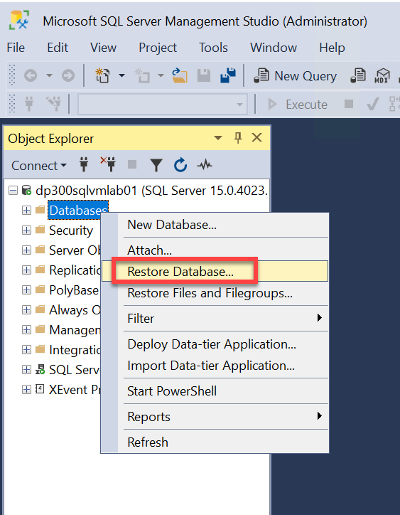

 

4. [データベースの復元] ダイアログの [ソース] で [デバイス] を選択し、省略記号の付いたデバイスの右側にあるボタンを選択します。 

    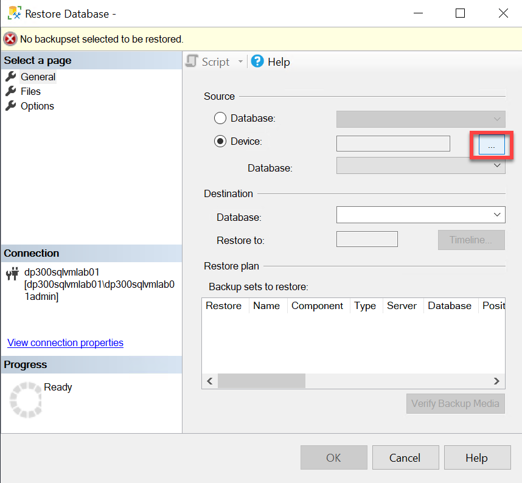

 

5. [バックアップデバイスの選択] ダイアログで、[追加] を選択します。 

    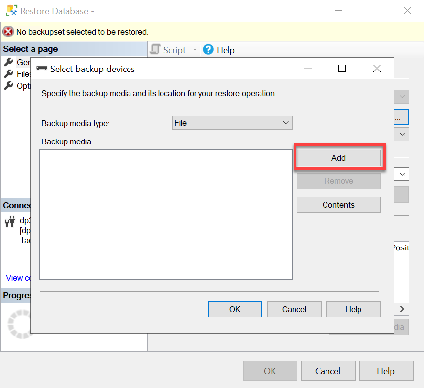


6. [ローカルバックアップファイル] ダイアログで、AdventureWorksDW2017.bak を選択し、[OK] ボタンを選択します。 

    

 
7. [バックアップ デバイスの選択] ダイアログの [バックアップ メディア] に 1 つのアイテムが表示されていることを確認します。 次に、[OK] ボタンを選択します。

    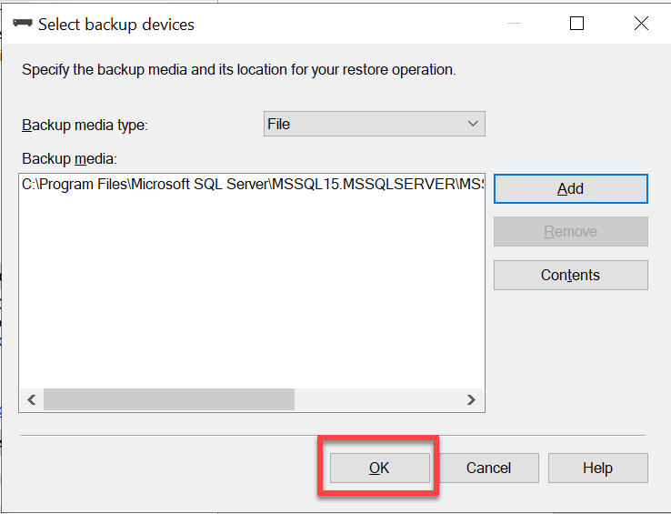


8. [データベースの復元] ダイアログの [復元するバックアップ セット] に 1 つの項目が表示されていることを確認します。 次に、[OK] ボタンを選択します。 

    

 
9. データベースの復元が完了すると、ダイアログ ボックスに "データベース 'AdventureWorksDW2017' が正常に復元されました" というメッセージが表示されます。 [OK] ボタンを選択します。

    

 

10. オブジェクト エクスプローラーで、[データベース] ノードを展開し、次に [AdventureWorksDW2017] ノードを展開して、[テーブル] ノードを展開します。 データベースに dbo.DimAccount を含むいくつかのテーブルが含まれていることを確認します。

    

 
11. Management Studio のオブジェクト エクスプローラーで、AdventureWorksDW2017 ノードを選択します。 次に、[新しいクエリ] ボタンを選択します。 

    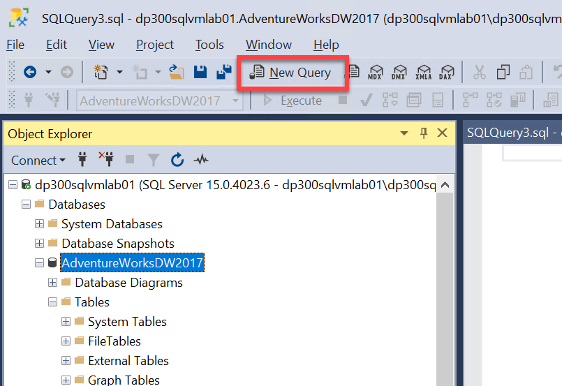


12. 次のステートメントをコピーして、新しいクエリ ウィンドウに貼り付けます。 

    ```SQL
    SELECT CalendarYear, Sum(SalesAmount) SalesAmount 

    FROM dbo.FactInternetSales FS

    INNER JOIN dbo.DimDate DD ON FS.OrderDateKey = DD.DateKey

    GROUP BY CalendarYear
    ```

    


13. [実行] ボタンを選択し、クエリを実行します。 2010 の販売額が**43421.0364**であることを確認します。 

    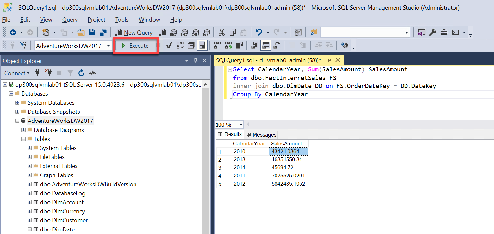

 

 

## <a name="task-3-clean-up"></a>タスク 3:クリーンアップ

1. リモート デスクトップを終了します。 

2. このラボで作成した VM を削除して、コストを節約します。 以降のラボでは使用しません。 

3. **dp300sqlvmlab01** 仮想マシンのメイン (概要) ブレードに移動し、メニューの [削除] ボタンをクリックします。 

    
 
4. **[OK]** をクリックします。
