---
lab:
  title: ラボ 2 – PaaS Database のデプロイ
  module: Plan and Implement Data Platform Resources
ms.openlocfilehash: 6e426ad5e0a68ce02c851b36780acf6506ccd899
ms.sourcegitcommit: ea479a647efed10ce4bb2ef8af703ac03b7d434d
ms.translationtype: HT
ms.contentlocale: ja-JP
ms.lasthandoff: 03/30/2022
ms.locfileid: "141267291"
---
# <a name="lab-2--deploying-paas-databases"></a>ラボ 2 – PaaS Database のデプロイ

**推定完了時間:** 35-40 分

**前提条件:** None

**ラボ ファイル:** None

# <a name="lab-overview"></a>ラボの概要

受講者は、Virtual Network エンドポイントを使用して Azure SQL Database をデプロイするために必要な基本のリソースを構成します。 SQL Database への接続は、ラボの VM から Azure Data Studio を使用して検証されます。 最後に、Azure Database for PostgreSQL が作成されます。

# <a name="lab-objectives"></a>ラボの目的

受講者は以下のことができるようになります。

1. 基本的なリソースを構成する

2. Azure SQL Database をデプロイする

3. Azure Data Studio を使用して Azure SQL Database に接続する

4. Azure Database for PostgreSQL をデプロイする

# <a name="scenario"></a>シナリオ

AdventureWorks のデータベース管理者は、Virtual Network エンドポイントを含む新しい SQL データベースをセットアップして、デプロイのセキュリティを強化および簡略化します。 Azure Data Studio を使用して、データ クエリと結果保持のための SQL Notebook の使用を評価します。

最後に、追加のデータ システムのニーズをサポートするために、Azure Database for PostgreSQL がデプロイされます。

# <a name="exercise-1-configure-basic-resources"></a>演習 1:基本的なリソースを構成する

## <a name="task-1-create-a-resource-group"></a>タスク 1:リソース グループを作成する

1. ブラウザーを起動し、[https://portal.azure.com](https://portal.azure.com/) の Azure portal を開き、適切な資格情報でログインします。

2. ホーム画面で、 **[リソース グループ]** ボタンをクリックします。  

    

3. 既存のリソース グループを確認し、 **[作成]** ボタンをクリックして新しいリソース グループを作成します。  

    

4. RG の作成に必要な情報を使用して、リソース グループの作成ウィザードを完了します。

    - サブスクリプションが目的のサブスクリプションに設定されていることを確認します

    - リソース グループ名として「**DP-300-Lab02**」と入力します

    - このラボでは、物理的に最も近い場所のリージョンを選択します

    - **[確認および作成]** ボタンをクリックします  

    

    - **[作成]** ボタンをクリックします

## <a name="task-2-create-a-virtual-network"></a>タスク 2:仮想ネットワークを作成する

1. 左側のナビゲーション ペインで、 **[仮想ネットワーク]** をクリックします  

    

2. **[+ 作成]** をクリックして **[仮想ネットワークの作成]** ページを開きます。 **[基本]** タブで次の情報を入力します。

    - [サブスクリプション]:**ラボのサブスクリプションを選択します**

    - リソース グループ:
          **DP-300-Lab02** リソース グループを選択します

    - 名前: **Lab02-vnet**

    - リージョン: リソース グループを作成した場所と同じリージョン (最寄りのリージョン) を選択します  

    

    - **[次: IP アドレス]** ボタンをクリックします  

    

3. Azure SQL データベース エンドポイントの仮想ネットワークの IP 範囲を構成する

    - [IP アドレス] ページでは、IPv4 アドレス空間を既定値のままにします。

    - **既定** のサブネットをクリックします。 (表示されるサブネット アドレス範囲は異なる場合があります。)  

    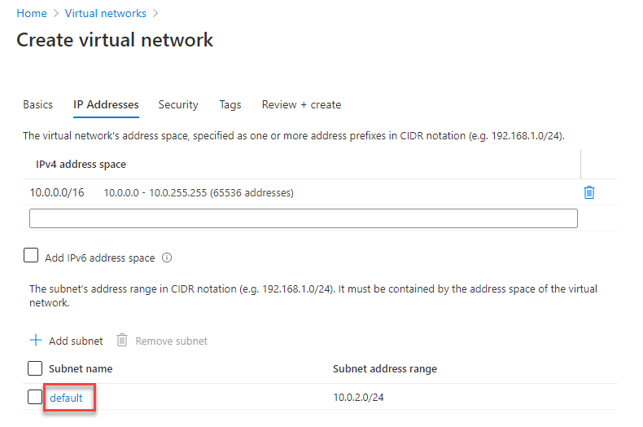

    - 右側の [サブネットの編集] ポップアップで、[サービス] ドロップダウンを展開し、 **[Microsoft.Sql]** にチェックを付けます。  

    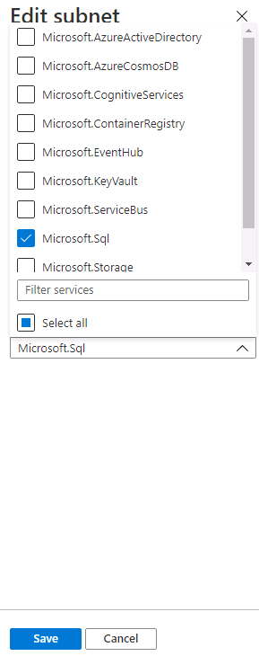

    - **[Save](保存)** をクリックします。

    - **[確認および作成]** ボタンをクリックし、新しい仮想ネットワークの設定を確認して、 **[作成]** をクリックします

# <a name="exercise-2-deploy-an-azure-sql-database"></a>演習 2:Azure SQL データベースをデプロイする

## <a name="task-1-deploy-an-azure-sql-database"></a>タスク 1:Azure SQL データベースをデプロイする

1. Azure portal で、左側のナビゲーション バーの上部にある **[+ リソースの作成]** をクリックします  

    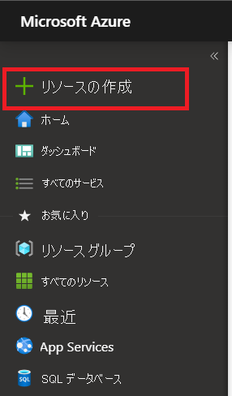

2. 上部の検索ボックスで「SQL Database」を検索し、オプションのリストから **[SQL Database]** をクリックします  

    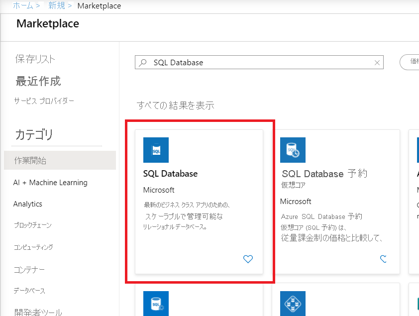

3. **[作成]** ボタンをクリックします

4. 「SQL Database の基本の作成」画面に次の情報を入力し、 **[次へ: ネットワーク]** をクリックします

    - [サブスクリプション]:ラボのサブスクリプションを選択します

    - リソース グループ:**DP-300-Lab02** (演習 1 で作成した RG)

    - データベース名: **AdventureWorksLT**
    
    - サーバー: **[新規作成]** をクリックします。 New Server サイドバーで、フォームに次のように入力します。

        - サーバー名: **dp300-lab-&lt;自分のイニシャル (小文字)&gt;** (サーバー名はグローバルに一意である必要があります)
        
        - 場所: 最寄りのリージョンを選択します (演習 1 と同じ)。

        - サーバー管理者のログイン: **dp300admin**

        - パスワード: **dp300P@ssword!**

        - パスワードの確認: **dp300P@ssword!**

        - 新しいサーバーのサイドバーは次のようになります。 **[OK]**

        

    -  [SQL データベースの作成] ページで、 **[Want to use Elastic Pool]\(エラスティック プールを使用する\)** が **[いいえ]** に設定されていることを確認します。

    -  コンピューティング + ストレージ: **[データベースの構成]** をクリックします

        - [構成] 画面の [サービス レベル] ドロップダウンで **[Basic]** を選びます。

        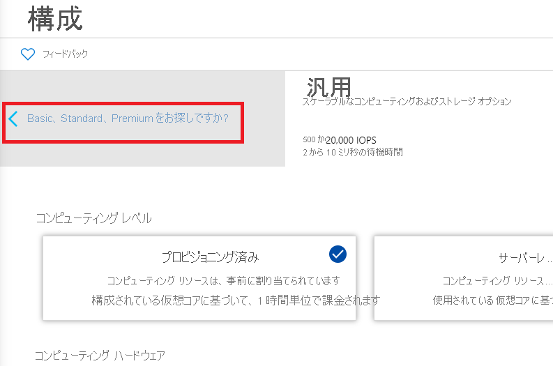

        - **[基本]** をクリックします

        - **[適用]** ボタンをクリックします

**注:このサーバー名とログイン情報を書き留めます。これは後のラボで使用します。**

5. **[ストレージの冗長性をバックアップする]** オプションが表示された場合は、既定値:**geo 冗長バックアップ ストレージ** のままにします。 

6. 設定を確認し、 **[次へ:ネットワーク]** をクリックします  

    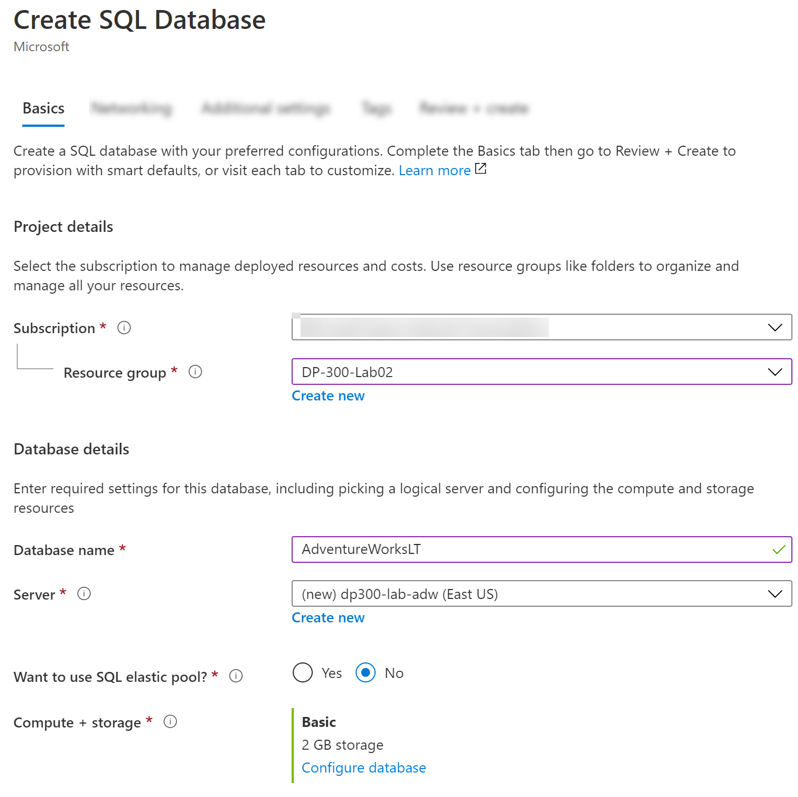

7. ネットワーク 画面の 接続方法 で、**プライベート エンドポイント** ラジオ ボタンをクリックします  

    

8. 次に、プライベート エンドポイントの下の **[プライベート エンドポイントの追加]** リンクをクリックします。  

    

9. 次のように、[プライベート エンドポイントの作成] フライアウトを完了します。

    - [サブスクリプション]:ラボのサブスクリプションが選択されていることを確認します

    - リソース グループ: **DP-300-Lab02**

    - 場所: このラボの前のパートで選択したのと同じリージョン

    - 名前: **DP-300-SQL-Endpoint**

    - ターゲット サブリソース: **SqlServer**

    - 仮想ネットワーク：**Lab02-vnet**

    - サブネット: **default (10.x.0.0/24)**

    - [プライベート DNS 統合] オプションは既定値のままにしておきます

    - **[OK]** をクリックする前に設定を確認します  

    

10. エンドポイントが [ネットワーク] ページに表示されていることを確認します。 

    

11. **[次: セキュリティ]** ボタンをクリックし、 **[次へ: 追加設定]** ボタンをクリックします。  

12. [追加の設定] ページで、次のオプションを選択します。

    - [既存のデータを使用します] を **[サンプル]** に設定します

    

13. **[確認と作成]** をクリックします

14. 設定を確認してから、 **[作成]** をクリックします

15. デプロイが完了したら、**[リソースに移動]** ボタンをクリックします。  


## <a name="task-2-enable-all-azure-services-access-to-new-sql-server"></a>タスク 2:Azure サービスから新しい SQL Server へのアクセスをすべて有効にする

1. [SQL Database] ブレードで、上部のセクションにあるサーバー名のリンクをクリックします。  

    

2. SQL Server オブジェクトのナビゲーション ブレードで、 **[セキュリティ]** の下の **[ファイアウォールと仮想ネットワーク]** をクリックします

    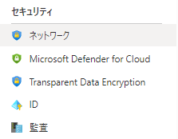

3. **[Azure サービスとリソースがこのサーバーにアクセスすることを許可する]** を **[はい]** に設定します  

    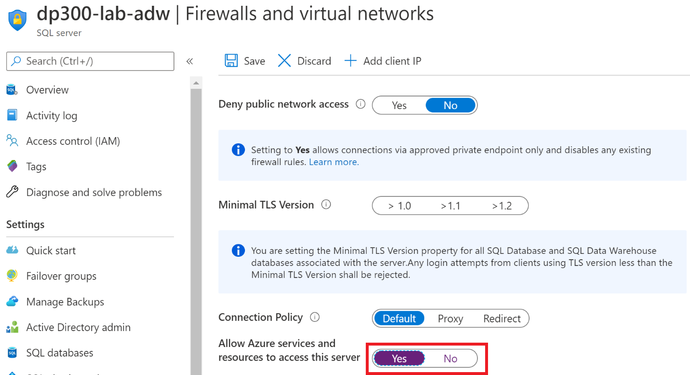

4. **[保存]** をクリックし、[成功] メッセージ ペインで **[OK]** をクリックします。

# <a name="exercise-3-connect-to-azure-sql-database"></a>演習 3:Azure SQL データベースへの接続

## <a name="task-1-register-azure-sql-database-instance-in-azure-data-studio"></a>タスク 1:Azure Data Studio で Azure SQL Database インスタンスを登録する

1. ラボ VM から Azure Data Studio (ADS) を起動する

    - Azure Data Studio の初回起動時にこのポップアップが表示される場合があります。 受信したら、 **[はい]** をクリックします  


2. Azure Data Studio が開いたら、Azure Data Studio の左側のサイドバーにある **[接続]** ボタンをクリックしてから、 **[接続の追加]** ボタンをクリックします。
    
    

3. **接続** サイドバーの 接続の詳細 セクションに、前の演習で作成した SQL Database に接続するための接続情報を入力します

    - 接続の種類: **Microsoft SQL Server**

    - サーバー: 演習 2、タスク 1 で作成した SQL Server の名前を入力します。 例: **dp300-lab-xx.database.windows.net**  
    ['xx' ではなくイニシャルを使用してサーバー名を作成するように求められたことに注意してください]

    - 認証の種類: **SQL ログイン**

    - ユーザー名: **dp300admin**

    - パスワード: **dp300P@ssword!**

    - [データベース] ドロップダウンを展開して **AdventureWorksLT** を選択します。 
        - **注:** クライアント IP がこのサーバーにアクセスできるようにするあめにファイアウォールKI足を追加するよう求められることがあります。 ファイアウォール規則を追加するように求められた場合は、 **[アカウントの追加]** をクリックして、Azure アカウントにログインします。 新しいファイアウォール規則の作成画面で、 **[OK]** をクリックします。
        
        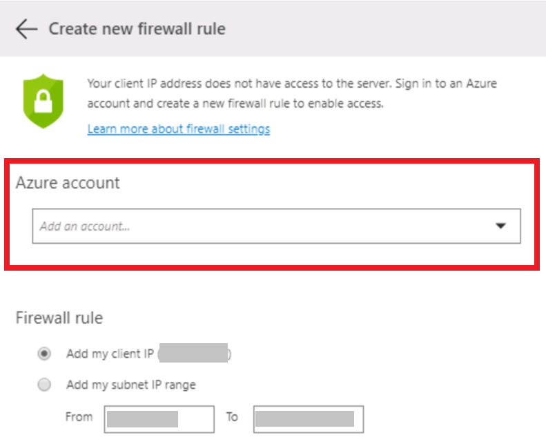
        
    接続　サイドバーに戻り、接続の詳細を入力し続けます。  
    
    - [サーバー グループ] は **&lt;既定値&gt;** のままです

    - [名前 (省略可能)] では、必要に応じてデータベースのフレンドリ名を指定できます

    - 設定を確認し、 **[接続]** をクリックします  

    

4. Azure Data Studio はデータベースに接続し、データベースに関するいくつかの基本情報と、オブジェクトの部分的なリストを表示します  

    

## <a name="task-2-query-azure-sql-database-with-a-sql-notebook"></a>タスク 2:SQL ノートブックを使用して Azure SQL Database へのクエリを実行する

1. このラボの AdventureWorksLT データベースに接続されている Azure Data Studio で、 **[新しいノートブック]** ボタンをクリックします  

    

2. ノートブックに新しいテキストボックスを追加するには、 **[+テキスト]** ボタンをクリックします  

    


**注:**  ノートブック内には、クエリまたは結果セットについて説明するプレーンテキストを埋め込むことができます。

3. 「**注文の小計別の上位 10 の顧客**」とテキストを入力し、必要に応じて太字にします  

    

4. **[+ コード]** ボタンをクリックして、ノートブックの最後に新しいセルを追加し、クエリを入力します  

    

5. 次の SQL ステートメントを新しいセルに貼り付けます

```sql
select top 10 cust.[CustomerID], cust.[CompanyName], sum(sohead.[SubTotal]) as OverallOrderSubTotal

  from [SalesLT].[Customer] cust

    inner join [SalesLT].[SalesOrderHeader] sohead

        on sohead.[CustomerID] = cust.[CustomerID]

   group by cust.[CustomerID], cust.[CompanyName]

   order by [OverallOrderSubTotal] desc
   ```

6. 矢印の付いた青い円をクリックして、クエリを実行します。 クエリによる結果がセル内にどのように含まれるかに注目してください。

7. **[+ テキスト]** ボタンをクリックして、新しいテキスト セルを追加します。

8. 「**上位 10 件の注文製品カテゴリ**」とテキストを入力し、必要に応じて太字にします

9. もう一度 **[+ コード]** ボタンをクリックして新しいセルを追加し、次の SQL ステートメントをセルに貼り付けます

```sql
select top 10 cat.[Name] as ProductCategory, sum(detail.[OrderQty]) as OrderedQuantity

    from salesLT.[ProductCategory] cat

       inner join saleslt.[Product] prod
      
          on prod.[ProductCategoryID] = cat.[ProductCategoryID]

       inner join salesLT.[SalesOrderDetail] detail

          on detail.[ProductID] = prod.[ProductID]

    group by cat.[name]

    order by [OrderedQuantity] desc
```
10.  矢印の付いた青い円をクリックしてクエリを実行します 

11. ノートブック内のすべてのセルを実行して結果を表示するには、ツールバーの **[セルの実行]** ボタンをクリックします  

    

12. Azure Data Studio 内で、[ノートブック] を [ファイル] メニューから D:\Labfiles\Deploy Azure SQL Database (このフォルダーは VM に既に存在します) ディレクトリに保存します([保存] または [名前を付けて保存])。 Azure Data Studio 内からノートブックのタブを閉じます。 [ファイル] メニューから [ファイルを開く] を選択し、保存したノートブックを開きます。 クエリの結果がクエリと共にノートブックに保存されていることを確かめます。

# <a name="exercise-4-deploy-an-azure-database-for-postgresql-database"></a>演習 4:Azure Database for PostgreSQL Database をデプロイする

## <a name="task-1-deploy-a-postgresql-database"></a>タスク 1:PostgreSQL データベースをデプロイする

1. Azure portal で、左側のナビゲーション バーの上部にある **[+ リソースの作成]** をクリックします

    

2. 上部の検索ボックスで「Azure Database for PostgreSQL」を検索し、結果の **[Azure Database for PostgreSQL]** をクリックします  

    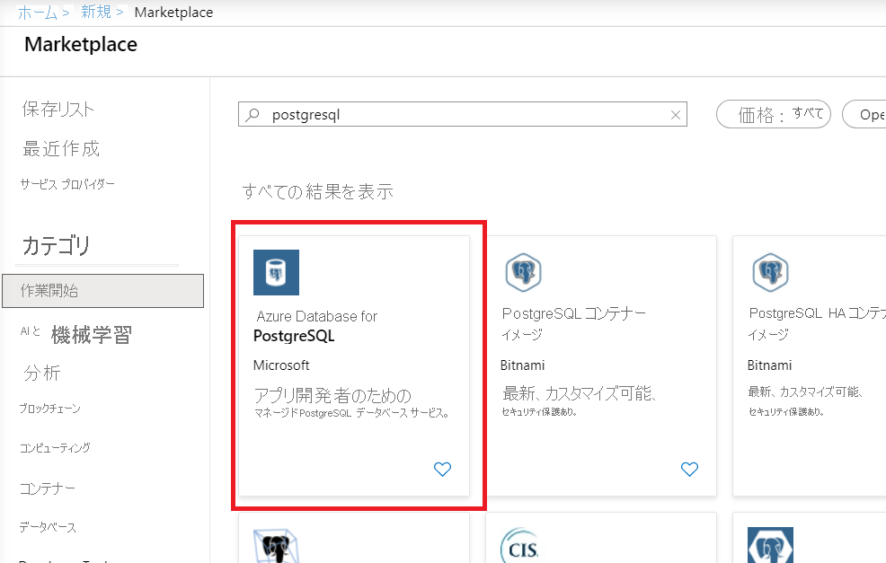

3. **[作成]** ボタンをクリックします

4. 単一サーバー オプションの **作成** をクリックします  

    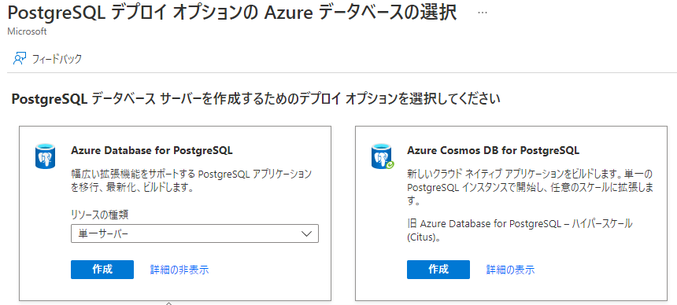

5. 以下の情報を [単一サーバーの基本] 画面に入力します。

    - [サブスクリプション]:ラボのサブスクリプションを選択します

    - リソース グループ:**DP-300-Lab02** (演習 1 で作成した RG)

    - サーバー名: **dp300-lab02-****&lt;自分のイニシャル&gt;** (サーバー名は一意である必要があります)

    - データソース: **なし**

    - 場所: このラボ全体で使用されている、最寄りのリージョンを選択します

    - バージョン: **10** または **11**

    - [コンピューティング + ストレージ] の下の **[サーバーの構成]** リンクをクリックします

        - **[Basic]** タブをクリックします

        - [仮想コア] スライダーを左端までスライドして、 **[1 個の仮想コア]** を選択します  

    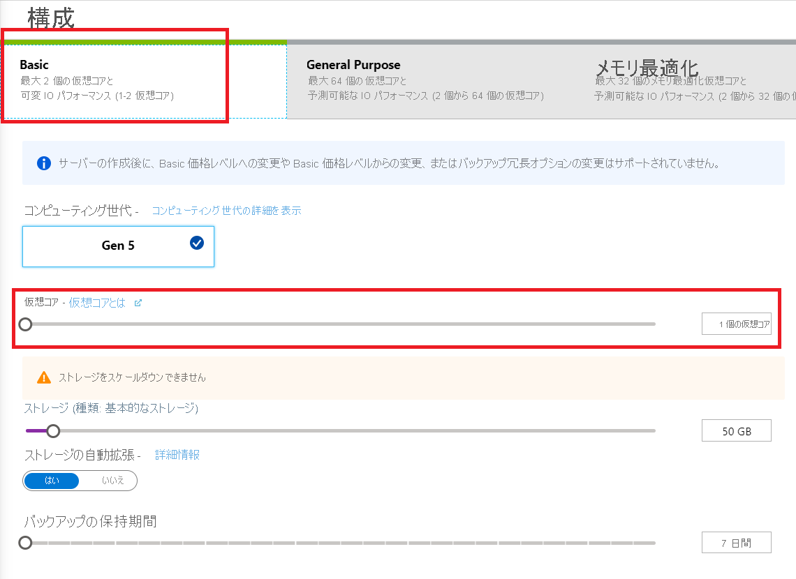

        - Click **OK**

    - 管理者ユーザー名: **dp300admin**

    - パスワード: **dp300P@ssword!**

    - パスワードの確認: **dp300P@ssword!**  
    

6. **[確認と作成]** をクリックします

7. 設定を確認し、 **[作成]** をクリックします

8. デプロイが完了したら、 **[リソースに移動]** をクリックします

## <a name="task-2-enable-all-azure-services-access-to-postgresql-database"></a>タスク 2:PostgreSQL データベースへのすべての Azure サービス アクセスを有効にする

1. データベースのサイドバーの 設定 にある **接続セキュリティ** ボタンをクリックします  

    

2. Azure サービスへのアクセスを許可する 設定を **はい** にスライドさせます。  **[+ 現在のクライアント IP アドレスを追加する]** 、 **[保存]** の順にクリックします。  

    


## <a name="task-3-connect-to-the-postgresql-database-with-azure-data-studio"></a>タスク 3:Azure Data Studio で PostgreSQL データベースに接続する

**注:**  PostgreSQL 拡張機能を Azure Data Studio にインストールすると、PostgreSQL にクエリを実行できます。 この拡張機能は、ラボ VM にプレインストールされています。


1. ラボの VM 上の Azure Data Studio で、接続 サイドバーが展開されていることを確認します。展開されていない場合は、左側のナビゲーション バーの **接続** ボタンをクリックします。

2. **[新しい接続]** ボタンをクリックします  

    

3. [接続の詳細] サイドバーに次の情報を入力して、前のタスクの PostgreSQL データベースに接続します。

    - 接続の種類: **PostgreSQL**

    - サーバー: タスク 1 で作成した PostgreSQL サーバーの名前を入力します。 例: **dp300-lab02-xx.postgres.database.azure.com** (サーバーの完全な名前は、ポータルの [概要] ペインで確認できます。) xx を追加した特定の文字に置き換える必要があるでしょう。 )

    - 認証の種類: **パスワード**

    - ユーザー名: **dp300admin@dp300-lab02-xx** (ユーザー名には上記で指定したホスト名の最初の部分を含める必要がある点に留意してください。'xx' の代わりにサフィックスを使用します。 管理者ユーザー名は、ポータルの [概要] ウィンドウにも表示されます。) 

    - パスワード: **dp300P@ssword!**

    - [データベース名] は **&lt;既定値&gt;** のままです

    - [サーバー グループ] は **&lt;既定値&gt;** のままです

    - [名前 (省略可能)] では、必要に応じてデータベースのフレンドリ名を指定できます

4. 設定を確認する  

    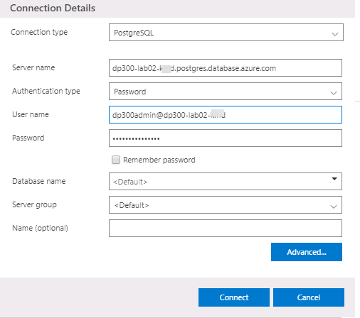

5. **[接続]**

6. PostgreSQL Database への Azure Data Studio の接続に注意してください。  

    
