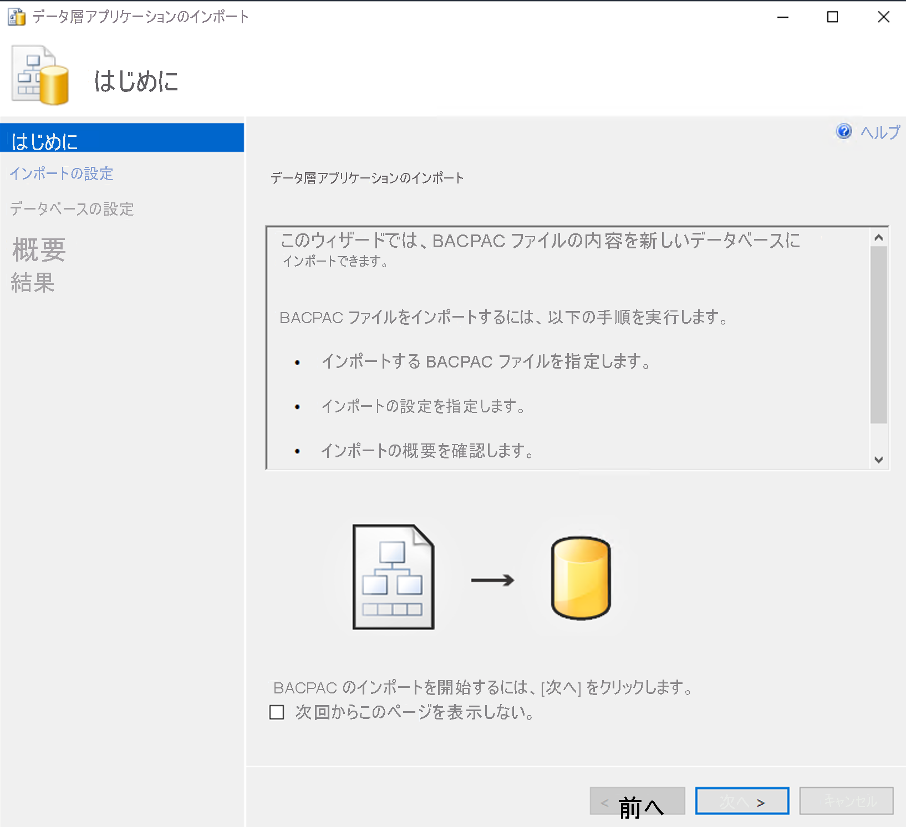
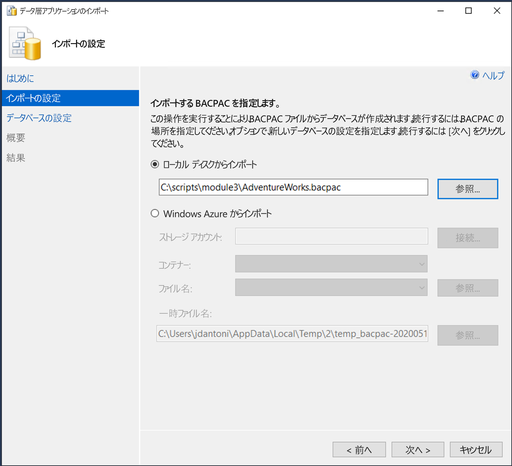
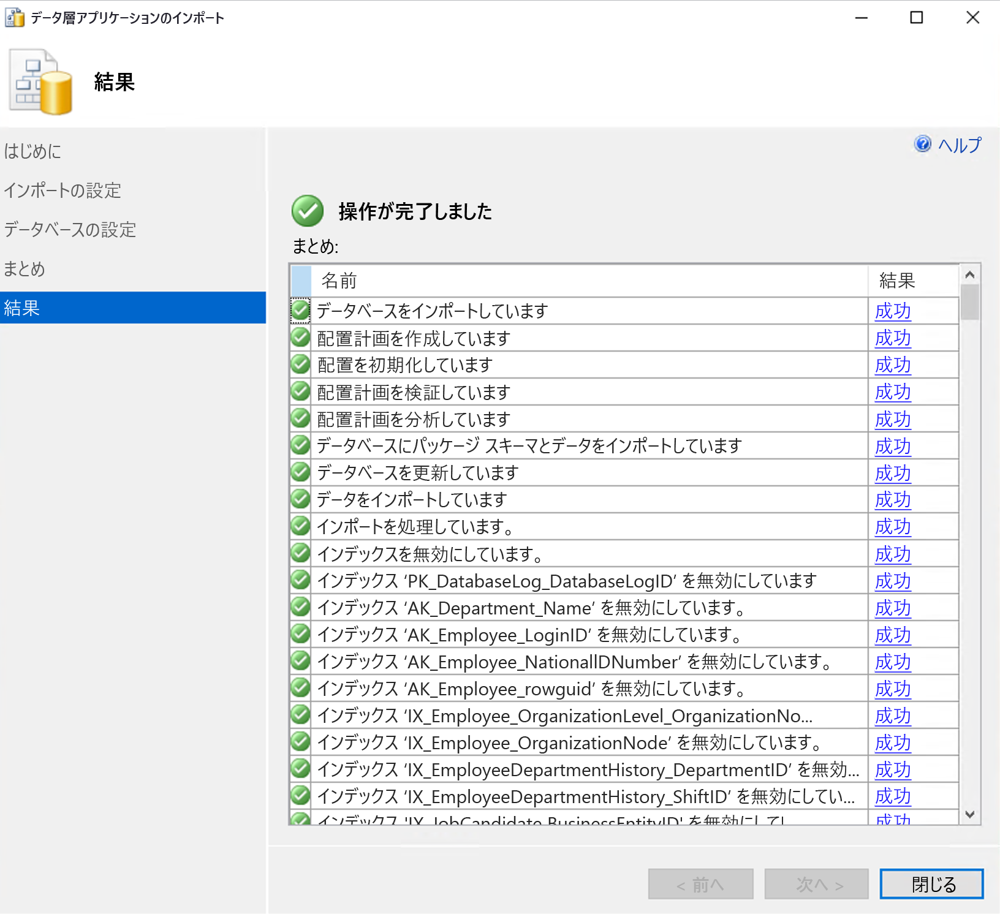
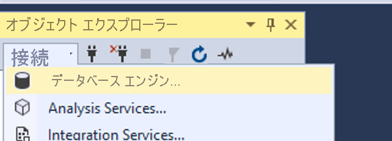

---
lab:
  title: ラボ 3 – 安全な環境を実装する
  module: Implement a Secure Environment
---

# <a name="lab-3--implement-a-secure-environment"></a>ラボ 3 – 安全な環境を実装する
 

**推定時間**:60 分

<bpt id="p1">**</bpt>Prerequisites<ept id="p1">**</ept>: An Azure SQL server you created in the lab for Module 2. Azure Active Directory access in the subscription.  

**ラボ ファイル**：このラボのファイル は、D:\Labfiles\Secure Environment フォルダーにあります。

# <a name="lab-overview"></a>ラボの概要

学生は、レッスンで得た情報を利用して、Azure portal と AdventureWorks データベース内でセキュリティを構成して実装します。 

# <a name="lab-objectives"></a>ラボの目的

このラボを完了すると、次のことができるようになります。

1. Azure SQL Database のファイアウォールを構成する

2. Azure Active Directory を使用して Azure SQL Database へのアクセスを承認する

3. Azure SQL データベースで Microsoft Defender for SQL を有効にする

4. Azure SQL Database のデータ分類の実装

5. データベース オブジェクトへのアクセスを管理する

# <a name="scenario"></a>シナリオ

You have been hired as a Senior Database Administrator help ensure the security of the database environment. These tasks will focus on Azure SQL Database. 

<bpt id="p1">**</bpt>Note:<ept id="p1">**</ept> The exercises ask you to copy and paste T-SQL code. Please verify that the code has been copied correctly, with the proper line breaks, before executing the code. 

## <a name="exercise-1-configure-an-azure-sql-database-firewall-and-connect-to-a-new-database"></a>演習 1:Azure SQL Database のファイアウォールを構成し、新しいデータベースに接続する

1. From the lab virtual machine, start a browser session and navigate to <bpt id="p1">[</bpt><ph id="ph1">https://portal.azure.com</ph><ept id="p1">](https://portal.azure.com/)</ept>. Provide appropriate credentials. 

    

2. **前提条件**:モジュール２のラボで作成した Azure SQL Server。

    

3. SQL サーバーの [詳細画面] で、マウスを [サーバー名] の右に移動し、以下に示すように [クリップボードにコピー] ボタンをクリックします。

    

4. サブスクリプションでの Azure Active Directory へのアクセス。

    

    This will allow you to connect to your Azure SQL Database server using SQL Server Management Studio or any other client tools. <bpt id="p1">**</bpt>Important:<ept id="p1">**</ept> Make note of your client IP address, you will use it later in this task.

5. Open SQL Server Management Studio on the lab VM. Paste in the name of your Azure SQL database server and login with the credentials you created in Lab 2:

    - サーバー名: **&lt;_Azure SQL Database のサーバー名をここに貼り付けてください_&gt;** 
         
     - 認証:**SQL Server 認証**  
    
    - サーバー管理者のログイン: **dp300admin**

    - パスワード: **dp300P@ssword!**

    

    **[Connect]** をクリックします。

6. In Object Explorer expand the server node, and right click on databases. Click Import a Data-tier Application.

    

7. [データ層アプリケーションのインポート] ダイアログで、最初の画面で [次へ] をクリックします。 

    

8. In the Import Settings screen, click Browse and navigate to D:\Labfiles\Secure Environment folder and click on the AdventureWorks.bacpac file and click open. Then in the Import Data-tier application screen click <bpt id="p1">**</bpt>Next<ept id="p1">**</ept>.

    

    

9. On the database settings screen, change the edition of Azure SQL Database to General Purpose. Change the Service Objective to <bpt id="p1">**</bpt>GP_Gen5_2<ept id="p1">**</ept> and click <bpt id="p2">**</bpt>Next<ept id="p2">**</ept>. 

    

10.  On the Summary screen click <bpt id="p1">**</bpt>Finish<ept id="p1">**</ept>. When your import completes you will see the results below. Then click <bpt id="p1">**</bpt>Close<ept id="p1">**</ept><ph id="ph1">
    </ph><ph id="ph2"></ph>

11. In Object Explorer, expand the Databases folder. Then right-click on AdventureWorks and click on new query. 

    

12. Execute the following T-SQL query by pasting the text into your query window. <bpt id="p1">**</bpt>Important:<ept id="p1">**</ept> Replace 192.168.1.1. with your client IP address from Step 4. Click execute or press F5.

    ```sql
    EXECUTE sp_set_database_firewall_rule @name = N'ContosoFirewallRule',

    @start_ip_address = '192.168.1.1', @end_ip_address = '192.168.1.1'
    ```

13. Next you will create a contained user in the AdventureWorks database. Click New Query and execute the following T-SQL. Ensure that you are still using the AdventureWorks database. If you see master in the database name box below, you can pull down and switch to AdventureWorks.

    ```sql
    CREATE USER containeddemo WITH PASSWORD = 'P@ssw0rd!'
    ```
    
    
    Click <bpt id="p1">**</bpt>Execute<ept id="p1">**</ept> to run this command. This command creates a contained user within the AdventureWorks database. You will login using the username and password in the next step.
    
14. Navigate to the Object Explorer. Click on <bpt id="p1">**</bpt>Connect<ept id="p1">**</ept> and then <bpt id="p2">**</bpt>Database Engine<ept id="p2">**</ept>.

    

15. Attempt to connect with the credentials you created in step 13. 
    You will need to use the following information:  
    -  **ログイン:** containeddemo   
    -  **パスワード:**  P@ssw0rd! 
     
     **[Connect]** をクリックします。
     
     次のエラーが表示されます。

    

    データベース環境のセキュリティを確保するために、シニア データベース管理者として採用されました。

    

16. これらのタスクは Azure SQL Database に焦点を当てます。

    

17. 別のデータベースがオブジェクト エクスプローラーに表示されます。 

    

    Make sure the selection stays on the newly added database. Then click <bpt id="p1">**</bpt>Connect<ept id="p1">**</ept> from the Object Explorer and <bpt id="p2">**</bpt>Database Engine<ept id="p2">**</ept>. 
    Enter the following again: 
    - **ログイン:** containeddemo   
    - **パスワード:**  P@ssw0rd! 

    **[Connect]** をクリックします。

    今回の接続では master データベースがバイパスされ、AdventureWorks に直接ログインします。これは、新しく作成されたユーザーがアクセスできる唯一のデータベースです。

## <a name="exercise-2-authorize-access-to-azure-sql-database-with-azure-active-directory"></a>演習 2:Azure Active Directory で Azure SQL Database へのアクセスを承認する

1. Azure portal に移動し、画面の右上隅にあるユーザー名をクリックします。

    

    ユーザー名をメモしてください。 
    
    **注:**  演習では、T-SQL コードをコピーして貼り付けるように求められます。

2. Azure portal で Azure SQL Database サーバー **dp300-lab-xx** に移動し、Active Directory 管理者の横にある、 **[未構成]** をクリックします。

    

    次の画面で、 **[管理者の設定]** をクリックします。

    

3. コードを実行する前に、コードが正しくコピーされ、改行されていることを確認してください。

    

4. Open SQL Server Management Studio and click <bpt id="p1">**</bpt>Connect<ept id="p1">**</ept>, then <bpt id="p2">**</bpt>Database Engine<ept id="p2">**</ept>. In the server name enter the name of your server. Change the authentication type to Azure Active Directory Universal with MFA.

    

    Azure Active Directory のパスワードを入力するよう求められます。 **[接続]** をクリックしてデータベースにログインします。 

## <a name="exercise-3-enable-microsoft-defender-for-sql-and-data-classification"></a>演習 3:Microsoft Defender for SQL とデータ分類を有効にする

1. Azure SQL サーバーのメイン ブレードから、**[セキュリティ]** セクションに移動し、**[Microsoft Defender for Cloud]** を選びます。

    

    このオプションが有効になっていない場合は、 **[Microsoft Defender for Cloud]** ページで、 **[Microsoft Defender for SQL を有効にする]** を選択します。

2. After Azure Defender for SQL is successfully enabled, select <bpt id="p1">**</bpt>Configure<ept id="p1">**</ept> option. You may need to refresh the page to see this option.

    ![[構成] オプションの選択のスクリーンショット](../images/dp-3300-module-33-lab-25_2.png)

3. ラボの仮想マシンからブラウザー セッションを開始し、[https://portal.azure.com](https://portal.azure.com/) に移動します。

    ![[サーバー設定] ページのスクリーンショット](../images/dp-3300-module-33-lab-25_3.png)

4. Azure SQL サーバーの概要画面で下にスクロールして、Azure portal の **AdventureWorksLT** データベースに移動し、データベース名を選択します。

    

5. Azure SQL Database のメイン ブレードの [セキュリティ] セクションに移動し、**[データの検出と分類]** を選択します。

    ![[データの検出と分類] が表示されたスクリーンショット](../images/dp-3300-module-33-lab-28.png)

6. 適切な資格情報を提供します。

    

7. 次の **[データの検出と分類]** 画面で、**[すべて選択]** の横にあるチェック ボックスをオンにして、**[Accepted selected recommendations]\(選択した推奨設定を承諾\)** を選択し、**[保存]** を選択して分類をデータベースに保存します。

    ![[選択した推奨事項を受け入れます] を示すスクリーンショット](../images/dp-3300-module-33-lab-30.png)

## <a name="exercise-4-manage-access-to-database-objects"></a>演習 4:データベース オブジェクトへのアクセスを管理する

1. In this exercise, you will manage access to the database and its objects. Navigate back to SQL Server Management Studio. The first thing you will do is create two users in the AdventureWorks database. 

    In the Object Explorer, right click on the AdventureWorks database and select <bpt id="p1">**</bpt>New Query<ept id="p1">**</ept>. In the new query window, copy and paste the following T-SQL into it. Verify that the code has been copied correctly. 

```sql
CREATE USER [DP300User1] WITH PASSWORD = 'Azur3Pa$$'

GO

CREATE USER [DP300User2] WITH PASSWORD = 'Azur3Pa$$'

GO
```

Azure portal の最上部にある検索ボックスで、「SQL」と入力します。

2. [SQL サーバー] アイコンが表示されます。 

```sql
CREATE ROLE [SalesReader]

GO

ALTER ROLE [SalesReader] ADD MEMBER [DP300User1]

GO

ALTER ROLE [SalesReader] ADD MEMBER [DP300User2]

GO
```

3. [SQL サーバー] をクリックします。

```sql
GRANT SELECT, EXECUTE ON SCHEMA::Sales TO [SalesReader]

GO
```
 

4. ラボ２で作成したサーバーの詳細ページに移動するには、[サーバー名] をクリックします

```sql
CREATE OR ALTER PROCEDURE Sales.DemoProc

AS

SELECT P.Name, Sum(SOD.LineTotal) as TotalSales ,SOH.OrderDate 

FROM Production.Product P

INNER JOIN Sales.SalesOrderDetail SOD on SOD.ProductID = P.ProductID

INNER JOIN Sales.SalesOrderHeader SOH on SOH.SalesOrderID = SOD.SalesOrderID

GROUP BY P.Name, SOH.OrderDate

ORDER BY TotalSales DESC

GO
```
 

5. Next you will use the EXECUTE AS USER command to test out the security you just created. This allows the database engine to execute a query in the context of your user. Clear the window of the previous query. Execute the below query in your query window.

```sql
EXECUTE AS USER = 'DP300User1'


SELECT P.Name, Sum(SOD.LineTotal) as TotalSales ,SOH.OrderDate 

FROM Production.Product P

INNER JOIN Sales.SalesOrderDetail SOD on SOD.ProductID = P.ProductID

INNER JOIN Sales.SalesOrderHeader SOH on SOH.SalesOrderID = SOD.SalesOrderID

GROUP BY P.Name, SOH.OrderDate

ORDER BY TotalSales DESC
```
 

This query will fail, with an error message saying the SELECT permission was denied on the Production.Product table. The role that user DP300User1 is a member of has SELECT permission in the Sales schema, but not in the Production schema. 

However, if you execute the stored procedure in that same context, the query will complete. Clear the query that gave an error message. Then execute the following T-SQL.

```sql
EXECUTE AS USER = 'DP300User1'

EXECUTE Sales.DemoProc
```

This happens because stored procedures take advantage a feature called ownership chaining to provide data access to users who do not have direct permissions to access database objects. For all objects that have the same owner, the database engine only checks the EXECUTE permission on the procedure and not the underlying objects. 

**このラボで作成されたリソースは、以降のラボの演習で使用されるため、削除しないでください。**
