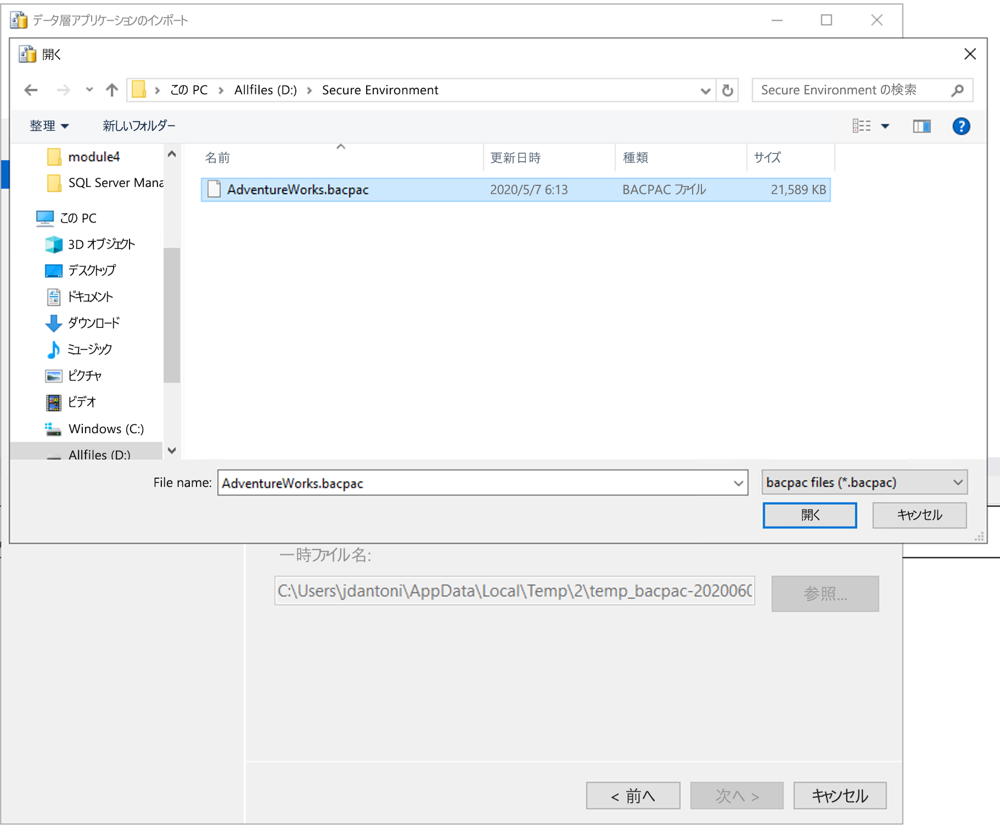
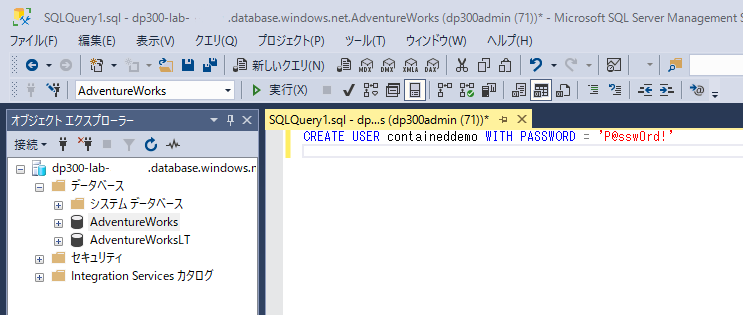
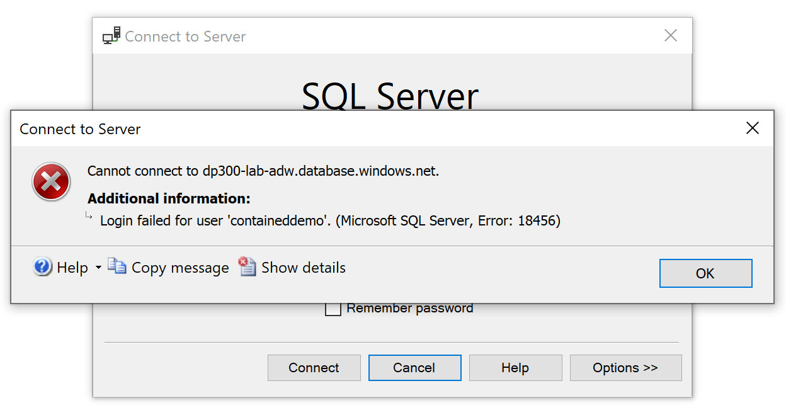
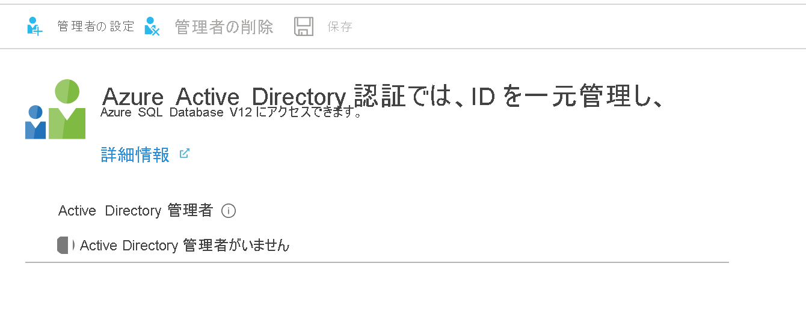
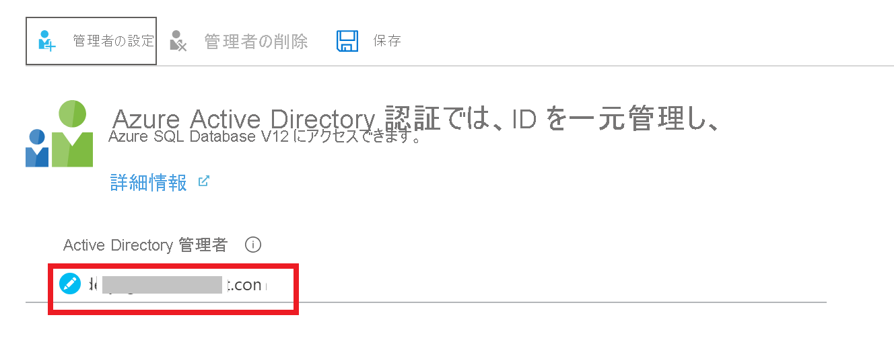

---
lab:
  title: ラボ 3 – 安全な環境を実装する
  module: Implement a Secure Environment
---

# <a name="lab-3--implement-a-secure-environment"></a>ラボ 3 – 安全な環境を実装する
 

**推定時間**:60 分

**前提条件**:モジュール２のラボで作成した Azure SQL Server。 サブスクリプションでの Azure Active Directory へのアクセス。  

**ラボ ファイル**：このラボのファイル は、D:\Labfiles\Secure Environment フォルダーにあります。

# <a name="lab-overview"></a>ラボの概要

学生は、レッスンで得た情報を利用して、Azure portal と AdventureWorks データベース内でセキュリティを構成して実装します。 

# <a name="lab-objectives"></a>ラボの目的

このラボを完了すると、次のことができるようになります。

1. Azure SQL Database のファイアウォールを構成する

2. Azure Active Directory を使用して Azure SQL Database へのアクセスを承認する

3. Azure SQL データベースで Microsoft Defender for SQL を有効にする

4. Azure SQL Database のデータ分類の実装

5. データベース オブジェクトへのアクセスを管理する

# <a name="scenario"></a>シナリオ

データベース環境のセキュリティを確保するために、シニア データベース管理者として採用されました。 これらのタスクは Azure SQL Database に焦点を当てます。 

**注:**  演習では、T-SQL コードをコピーして貼り付けるように求められます。 コードを実行する前に、コードが正しくコピーされ、改行されていることを確認してください。 

## <a name="exercise-1-configure-an-azure-sql-database-firewall-and-connect-to-a-new-database"></a>演習 1:Azure SQL Database のファイアウォールを構成し、新しいデータベースに接続する

1. ラボの仮想マシンからブラウザー セッションを開始し、[https://portal.azure.com](https://portal.azure.com/) に移動します。 適切な資格情報を提供します。 

    

2. Azure portal の最上部にある検索ボックスで、「SQL」と入力します。 [SQL サーバー] アイコンが表示されます。 [SQL サーバー] をクリックします。 ラボ２で作成したサーバーの詳細ページに移動するには、[サーバー名] をクリックします

    

3. SQL サーバーの [詳細画面] で、マウスを [サーバー名] の右に移動し、以下に示すように [クリップボードにコピー] ボタンをクリックします。

    

4. クリックして (コピーしたサーバー名の上にある) [ファイアウォール設定の表示] をクリックします。 以下で強調表示されている **+ クライアント IP の追加** をクリックしてから、保存 をクリックします。

    

    これにより、SQL Server Management Studio またはその他のクライアントツールを使用して、Azure SQL Database サーバーに接続できます。 **重要:** クライアントの IP アドレスをメモしてください。このタスクの後半で使用します。

5. ラボ VM で SQL Server Management Studio を開きます。 Azure SQL Database サーバーの名前を貼り付け、ラボ 2 で作成した資格情報でログインします。

    - サーバー名: **&lt;_Azure SQL Database のサーバー名をここに貼り付けてください_&gt;** 
         
     - 認証:**SQL Server 認証**  
    
    - サーバー管理者のログイン: **dp300admin**

    - パスワード: **dp300P@ssword!**

    

    **[Connect]** をクリックします。

6. オブジェクト エクスプローラーでサーバーノードを展開し、[データベース] を右クリックします。 [データ層アプリケーションのインポート] をクリックします。

    

7. [データ層アプリケーションのインポート] ダイアログで、最初の画面で [次へ] をクリックします。 

    

8. [設定のインポート] 画面で、[参照] をクリックして D:\Labfiles\Secure Environment フォルダーに移動し、AdventureWorks.bacpac ファイルをクリックし、[開く] をクリックします。 次に、データ層アプリケーションのインポート 画面で、 **次へ** をクリックします。

    

    

9. [データベース設定] 画面で、Azure SQL Database のエディションを General Purpose に変更します。 サービス目標を **GP_Gen5_2** に変更し、 **[次へ]** をクリックします。 

    

10.  概要 画面で **完了** をクリックします。 インポートが完了すると、次の結果が表示されます。 次に、 **[閉じる]** をクリックします
    

11. オブジェクト エクスプローラーで、[データベース] フォルダーを展開します。 次に、AdventureWorks を右クリックし、[新しいクエリ] をクリックします。 

    

12. テキストをクエリウィンドウに貼り付けて、次の T-SQL クエリを実行します。 **重要:** 192.168.1.1 を 手順 4 のクライアント IP アドレスに置き換えます。 [実行] をクリックするか、F5 を押してください。

    ```sql
    EXECUTE sp_set_database_firewall_rule @name = N'ContosoFirewallRule',

    @start_ip_address = '192.168.1.1', @end_ip_address = '192.168.1.1'
    ```

13. 次に、AdventureWorks データベースに含まれるユーザーを作成します。 [新しいクエリ] をクリックして、次の T-SQL を実行します。 まだ AdventureWorks データベースを使用していることを確認してください。 下のデータベース名ボックスに [マスター] が表示されている場合は、プルダウンして、[AdventureWorks] に切り替えることができます。

    ```sql
    CREATE USER containeddemo WITH PASSWORD = 'P@ssw0rd!'
    ```
    
    
    **[実行]** をクリックして、このコマンドを実行します。 このコマンドは、AdventureWorks データベース内に含まれるユーザーを作成します。 次のステップで、ユーザー名とパスワードを使用してログインします。
    
14. オブジェクト エクスプローラーに移動します。 **[接続]** 、 **[データベース エンジン]** の順にクリックします。

    

15. ステップ 13 で作成した資格情報を使用して接続を試みます。 
    次の情報を使用する必要があります。  
    -  **ログイン:** containeddemo   
    -  **パスワード:**  P@ssw0rd! 
     
     **[Connect]** をクリックします。
     
     次のエラーが表示されます。

    

    このエラーは、ユーザーが作成された AdventureWorks ではなく、マスター データベースに接続しようとしたために生成されます。 **[OK]** をクリックして接続コンテキストを変更し、エラー メッセージを終了して、次に示すように サーバーに接続 ダイアログ ボックスの **[オプション >>]** をクリックします。

    

16. [接続オプション] タブで、[AdventureWorks] というデータベース名を入力します。 **[Connect]** をクリックします。

    

17. 別のデータベースがオブジェクト エクスプローラーに表示されます。 

    

    選択が新しく追加されたデータベースにとどまっていることを確認してください。 次に、オブジェクト エクスプローラーと**データベース エンジン**から **[接続]** をクリックします。 
    次のようにもう一度入力します。 
    - **ログイン:** containeddemo   
    - **パスワード:**  P@ssw0rd! 

    **[Connect]** をクリックします。

    今回の接続では master データベースがバイパスされ、AdventureWorks に直接ログインします。これは、新しく作成されたユーザーがアクセスできる唯一のデータベースです。

## <a name="exercise-2-authorize-access-to-azure-sql-database-with-azure-active-directory"></a>演習 2:Azure Active Directory で Azure SQL Database へのアクセスを承認する

1. Azure portal に移動し、画面の右上隅にあるユーザー名をクリックします。

    

    ユーザー名をメモしてください。 
    
    **重要:** Azure SQL Database 向けの Azure Active Directory 管理者の場合、Microsoft アカウント (Outlook、Gmail、Hotmail、または Yahoo のユーザー アカウントなど) は**サポートされていません**。 回避策として、DBA という名前の Azure Active Directory グループを作成し、ユーザー アカウントを追加できます。 また、演習 2 をスキップすることも可能です。

2. Azure portal で Azure SQL Database サーバー **dp300-lab-xx** に移動し、Active Directory 管理者の横にある、 **[未構成]** をクリックします。

    

    次の画面で、 **[管理者の設定]** をクリックします。

    

3. [管理者の設定] 画面で、ユーザー名を検索します。 見つかったら、それをクリックしてユーザー名を強調表示し、 **[選択]** をクリックします。 再度、上の [Active Directory 管理者] 画面が表示されます。 **[保存]** をクリックして、処理を完了します。 これにより、以下に示すように、ユーザー名がサーバーの Azure Active Directory 管理者になります

    

4. SQL Server Management Studio を開き、 **[接続]** > **[データベース エンジン]** をクリックします。 サーバー名に自分のサーバーの名前を入力します。 認証の種類を [Azure Active Directory - MFA で汎用] に変更します。

    

    Azure Active Directory のパスワードを入力するよう求められます。 **[接続]** をクリックしてデータベースにログインします。 

## <a name="exercise-3-enable-microsoft-defender-for-sql-and-data-classification"></a>演習 3:Microsoft Defender for SQL とデータ分類を有効にする

1. Azure SQL サーバーのメイン ブレードから、**[セキュリティ]** セクションに移動し、**[Microsoft Defender for Cloud]** を選びます。

    

    このオプションが有効になっていない場合は、 **[Microsoft Defender for Cloud]** ページで、 **[Microsoft Defender for SQL を有効にする]** を選択します。

2. Azure Defender for SQL が正常に有効になったら、**[構成]** オプションを選びます。 このオプションを表示するには、ページを最新の情報に更新することが必要な場合があります。

    ![[構成] オプションの選択のスクリーンショット](../images/dp-3300-module-33-lab-25_2.png)

3. **[サーバー設定]** ページで、**[MICROSOFT DEFENDER FOR SQL]** が **[オン]** に設定されていて、**ストレージ アカウント**名が指定されていることを確認します。 **[スキャン レポートの送信先]** に Azure アカウントのメール アドレスを入力し、**[保存]** を選びます。

    ![[サーバー設定] ページのスクリーンショット](../images/dp-3300-module-33-lab-25_3.png)

4. Azure SQL サーバーの概要画面で下にスクロールして、Azure portal の **AdventureWorksLT** データベースに移動し、データベース名を選択します。

    

5. Azure SQL Database のメイン ブレードの [セキュリティ] セクションに移動し、**[データの検出と分類]** を選択します。

    ![[データの検出と分類] が表示されたスクリーンショット](../images/dp-3300-module-33-lab-28.png)

6. **[データの検出と分類]** 画面に、"**分類の推奨事項を含む列が 15 個見つかりました**" という情報メッセージが表示されます。 そのリンクを選択します。

    

7. 次の **[データの検出と分類]** 画面で、**[すべて選択]** の横にあるチェック ボックスをオンにして、**[Accepted selected recommendations](選択した推奨設定を承諾)** を選択し、**[保存]** を選択して分類をデータベースに保存します。

    ![[選択した推奨事項を受け入れます] を示すスクリーンショット](../images/dp-3300-module-33-lab-30.png)

## <a name="exercise-4-manage-access-to-database-objects"></a>演習 4:データベース オブジェクトへのアクセスを管理する

1. この演習では、データベースとそのオブジェクトへのアクセスを管理します。 SQL Server Management Studio に戻ります。 まず、AdventureWorks データベースに 2 人のユーザーを作成します。 

    オブジェクト エクスプローラーで、AdventureWorks データベースを右クリックし、 **[新しいクエリ]** を選択します。 新しいクエリ ウィンドウで、次の T-SQL をコピーして貼り付けます。 コードが正しくコピーされたことを確認します。 

```sql
CREATE USER [DP300User1] WITH PASSWORD = 'Azur3Pa$$'

GO

CREATE USER [DP300User2] WITH PASSWORD = 'Azur3Pa$$'

GO
```

これらのユーザーはデータベースのスコープ内で作成されることがわかります。 したがって、これらのユーザーの 1 人でログインしようとする場合は、接続文字列で AdventureWorks データベースを指定する必要があります。

2. 次に、カスタム ロールを作成して、そこにユーザーを追加します。 手順 1 と同じクエ リウィンドウに次の T-SQL を追加します。 **[実行]** をクリックして実行します。 

```sql
CREATE ROLE [SalesReader]

GO

ALTER ROLE [SalesReader] ADD MEMBER [DP300User1]

GO

ALTER ROLE [SalesReader] ADD MEMBER [DP300User2]

GO
```

3. 次に、ロールに権限を付与します。 この場合、Sales スキーマに SELECT と EXECUTE を割り当てます。 前のクエリのウィンドウをクリアします。 次に、同じウィンドウで、 **[実行]** をクリックして以下の T-SQL を実行し、ロールにアクセス許可を付与します。

```sql
GRANT SELECT, EXECUTE ON SCHEMA::Sales TO [SalesReader]

GO
```
 

4. 次に、Sales スキーマに新しいストアド プロシージャを作成します。 この手順が Product スキーマのテーブルにアクセスすることを確認します。 前のクエリのウィンドウをクリアします。 クエリ ウィンドウで次の T-SQL を実行します。

```sql
CREATE OR ALTER PROCEDURE Sales.DemoProc

AS

SELECT P.Name, Sum(SOD.LineTotal) as TotalSales ,SOH.OrderDate 

FROM Production.Product P

INNER JOIN Sales.SalesOrderDetail SOD on SOD.ProductID = P.ProductID

INNER JOIN Sales.SalesOrderHeader SOH on SOH.SalesOrderID = SOD.SalesOrderID

GROUP BY P.Name, SOH.OrderDate

ORDER BY TotalSales DESC

GO
```
 

5. 次に、EXECUTE AS USER コマンドを使用して、作成したセキュリティをテストします。 これでデータベース エンジンに、ユーザーのコンテキストでクエリを実行させることができます。 前のクエリのウィンドウをクリアします。 クエリ画面で以下のクエリを実行します。

```sql
EXECUTE AS USER = 'DP300User1'


SELECT P.Name, Sum(SOD.LineTotal) as TotalSales ,SOH.OrderDate 

FROM Production.Product P

INNER JOIN Sales.SalesOrderDetail SOD on SOD.ProductID = P.ProductID

INNER JOIN Sales.SalesOrderHeader SOH on SOH.SalesOrderID = SOD.SalesOrderID

GROUP BY P.Name, SOH.OrderDate

ORDER BY TotalSales DESC
```
 

このクエリは失敗し、Production.Product テーブルに対する SELECT 権限が拒否されたことを示すエラーメッセージが表示されます。 ユーザー DP300User1 がメンバーであるロールは、Sales スキーマでは SELECT 権限を持っていますが、Production スキーマでは持っていません。 

ただし、同じコンテキストでストアド プロシージャを実行すると、クエリは完了します。 エラー メッセージが表示されたクエリをクリアします。 次に、次の T-SQL を実行します。

```sql
EXECUTE AS USER = 'DP300User1'

EXECUTE Sales.DemoProc
```

これは、ストアド プロシージャが所有権チェーンと呼ばれる機能を利用して、データベース オブジェクトに直接アクセスする権限を持たないユーザーにデータ アクセスを提供するために発生します。 同じ所有者を持つすべてのオブジェクトについて、データベース エンジンはプロシージャの EXECUTE 権限のみをチェックし、基になるオブジェクトはチェックしません。 

**このラボで作成されたリソースは、以降のラボの演習で使用されるため、削除しないでください。**
