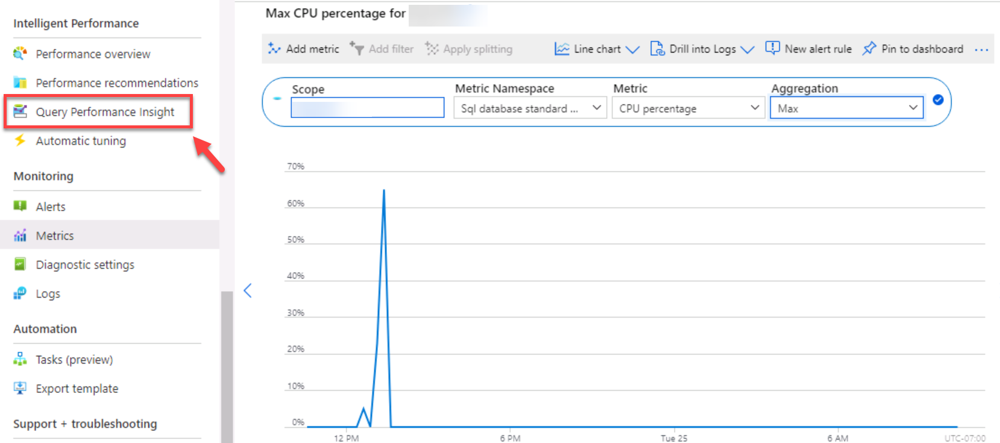
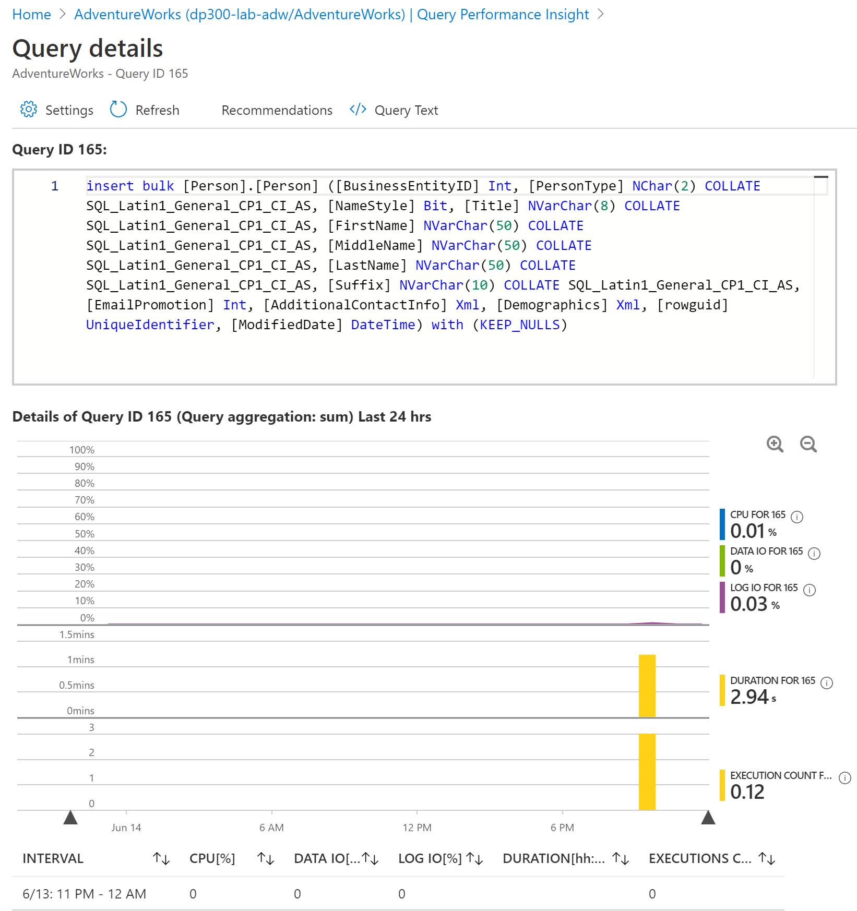
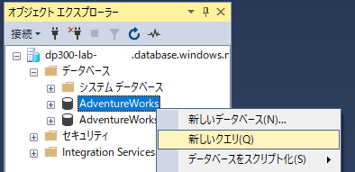
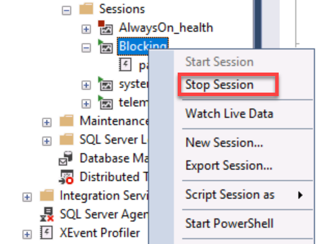

---
lab:
  title: ラボ 4 –リソースの監視と最適化
  module: Monitor and Optimize Operational Resources
---

# <a name="lab-4--monitor-and-optimize-resources"></a>ラボ 4 –リソースの監視と最適化


**推定時間**:60 分

**前提条件**:ラボ VM、およびラボ 2 と 3 で作成された Azure SQL データベース


# <a name="lab-overview"></a>ラボの概要


学生は、レッスンで得た情報を利用して、AdventureWorks 内のデジタルトランスフォーメーション プロジェクトの成果物を調べます。 受講生は、Azure portal と他のツールを調べ、ネイティブ ツールを利用してパフォーマンス関連の問題を特定して解決する方法を決定します。 最後に、受講生はデータベース内の断片化を特定し、問題を適切に解決する手順を学ぶことができます。 


# <a name="lab-objectives"></a>ラボの目的


このラボを完了すると、次のことができるようになります。

1. 監視を通じてパフォーマンスの問題を特定します。 

2. クエリ ストアを利用して、新しいインデックスを作成し、ブロッキングの問題を特定して解決する

3. 断片化の問題を検出して修正します。 


# <a name="scenario"></a>シナリオ


あなたは、パフォーマンス関連の問題を見つけ出して、見つかった問題を解決するための実用的ソリューションを提供するデータベース管理者として雇用されています。 AdventureWorks は、10 年以上にわたって自転車と自転車部品を消費者と販売業者に直接販売しています。 同社は、Azure Virtual Machine で Azure SQL データベースと SQL Server の両方を組み合わせて利用しています。 最近同社は、顧客の依頼に対応するために使用される両方の製品のパフォーマンスの低下に気づきました。 Azure portalとオンプレミスのツールを使用して、パフォーマンスの問題を特定し、解決方法を提案する必要があります。 
 
        

**注:**  演習では、T-SQL コードをコピーして貼り付けるように求められます。 コードを実行する前に、コードが正しくコピーされ、改行されていることを確認してください。 

        

# <a name="exercise-1-isolate-problems-by-monitoring"></a>演習 1:監視によって問題を特定する


予測される所要時間:30 分

この演習の主なタスクは次のとおりです。

1. 監視ソリューションを確認して、Azure SQL データベースのパフォーマンス関連の問題を特定する

2. クエリ ストアを使用して、進行中のブロッキングの問題を特定し、ブロッキングを解決するために実装する適切なインデックスを特定します。 

3. クエリ ツールを使用してインデックスの断片化を識別し、断片化を解決する方法を提供します。 

 

## <a name="task-1-review-cpu-utilization-in-azure-portal"></a>タスク 1:Azure Portal で CPU 使用率を確認する

1. まだ Azure portal に入っていない場合は、portal.azure.com に戻ります。 再度ログインする必要があるかもしれません。 Azure Portal の上部にある検索バーに「SQL」と入力し、SQL データベースをクリックします。 このタスクでは、ラボ 3 で作成した AdventureWorks データベースを使用します。 データベース名をクリックします。


    


2. AdventureWorks データベース ブレードの [監視] セクションで [メトリック] を見つけて選択します。 


3.  CPU パーセンテージを反映するようにメトリックメニューオプションを変更する

 
    

4. "Avg" の集約を選択します。 これにより、指定された概算時間の平均の [CPU の割合] が表示されます。 

5. 次に、集計を Max に調整して、所定の時間枠に使用される最大 CPU パーセンテージを特定します。 それは、平均とどう違いますか？

## <a name="task-2-identify-high-cpu-consuming-queries"></a>タスク 2:CPU 使用率の高いクエリを特定する

1. 最初のタスクと同じビューで、インテリジェント パフォーマンスの同じメニューでクエリ パフォーマンスの分析情報を選択します。

    

2.  グラフの下のグリッドの最初のクエリをクリックします。 


    

3. 次の図に示すように、クエリとそのリソースの使用状況をメモします。 Azure は、クエリごとに CPU、データ IO、ログ IO を追跡します。

 
    


# <a name="exercise-2-identify-and-resolve-blocking-issues"></a>演習 2:ブロッキングの問題を特定して解決する


予測される所要時間:15 分

個別演習

この演習の主なタスクは次のとおりです。

1. 拡張イベントでブロッキング レポートを利用して、ブロッキングを引き起こしているクエリを特定する

2. ブロッキングを解決するために実装できるインデックスを特定する

## <a name="task-1-run-blocked-queries-report"></a>タスク 1:ブロックされたクエリ レポートの実行

この演習では、ラボの VM から SQL Server Management Studio を使用して、オンプレミスの SQL Server に接続します。 

1.  ラボの VM から [スタート] メニューを開き、   
    Microsoft SQL Server Tools 18> Microsoft SQL Server Management Studio に移動して SQL Server Management Studio を開きます。 または、タスク バーで Management Studio のアイコンを選択することもできます。 

    SQL Server に接続するように求められます。
    SQL Database に管理者IDを使用して接続します。


    

1. Management Studio で AdventureWorks データベースを右クリックして [新しいクエリ] を選択します。

    


1. 次のコードをコピーして、クエリ ウィンドウに貼り付けます。 

    ```sql

   CREATE EVENT SESSION [Blocking] ON DATABASE 
   ADD EVENT sqlserver.blocked_process_report(
  ACTION(sqlserver.client_app_name,sqlserver.client_hostname,sqlserver.database_id,sqlserver.database_name,sqlserver.session_id,sqlserver.sql_text,sqlserver.username))
  ADD TARGET package0.ring_buffer
  WITH (MAX_MEMORY=4096 KB, EVENT_RETENTION_MODE=ALLOW_SINGLE_EVENT_LOSS, MAX_DISPATCH_LATENCY=30 SECONDS, MAX_EVENT_SIZE=0 KB,MEMORY_PARTITION_MODE=NONE,
  TRACK_CAUSALITY=OFF,STARTUP_STATE=ON)
  GO
  -- Start the event session 
  ALTER EVENT SESSION [Blocking] ON DATABASE 
  STATE = start; 
  GO
  ```

    実行ボタンをクリックしてこのクエリを実行します。 

    上の T-SQL コードによって、ブロック イベントをキャプチャする拡張イベントセッションが作成されます。 データには、次の要素が含まれます。

    - クライアント アプリケーション名

    - クライアント ホスト名

    - データベース ID

    - データベース名

    - セッション ID

    - T-SQL テキスト

    - ユーザー名


1. SQL Server Management Studio から [新しいクエリ] をクリックします。 次の T-SQL コードをコピーして、クエリ ウィンドウに貼り付けます。 実行ボタンをクリックしてこのクエリを実行します。 

    ```sql

    BEGIN TRANSACTION

    UPDATE Person.Person SET LastName = LastName;

    GO
    ```
 

1. [新しいクエリ] ボタンをクリックして、別のクエリ ウィンドウを開きます。 次の T-SQL コードをコピーして、クエリ ウィンドウに貼り付けます。 実行ボタンをクリックしてこのクエリを実行します。 

    ```sql

    SELECT TOP (1000) [LastName]

    ,[FirstName]

    ,[Title]

    FROM Person.Person WITH (UPDLOCK)

    WHERE FirstName = 'David'
    ```
    

    このクエリはすぐには結果を返さず、まだ実行中のように見えます。


1. オブジェクト Explorer で、 **[管理]** に移動し、プラス記号をクリックしてハイブを展開します。 **[拡張イベント]** を展開してから、 **[セッション]** を展開します。 手順 3 で作成したセッションを含む **[Blocking]** を展開します。 **package0.ring_buffer** を右クリックして **[ターゲット データの表示]** を選択します。 

    

1. ハイパーリンクをクリックします。 

    

1. この XML では、ブロックされているプロセスと、ブロックの原因となっているプロセスを確認できます。 

    
 
1.  **[Blocking]** という拡張イベント セッションを右クリックし、 **[セッションの停止]** を選択します。 
    
    

1.  手順4で開いたクエリ タブに戻り、クエリの下の行に ROLLBACK TRANSACTION と入力します。 ROLLBACK TRANSACTION を強調表示し、コマンドを実行します。

  
 
1. 手順 5 で開いたクエリタブに戻ります。 クエリが完了していることがわかります。

1. すべてのクエリ ウィンドウを閉じます。


1. 手順3のクエリが完了したのに対し、前の演習ではUPDATEによってブロックされた理由をインストラクターと話し合います。 次の演習で必要になるので、SQL Server Management Studio を開いたままにしますが、すべてのクエリ ウィンドウを閉じます。 


# <a name="exercise-3-detectcorrect-fragmentation-issues"></a>演習 3:フラグメンテーションの問題を検出/修正


予測される所要時間:15 分

個別演習

この演習の主なタスクは次のとおりです。

1. 断片化を識別する 

2. 断片化を取り除く

2. インストラクターは、わかったことについてグループと話し合います。

## <a name="task-1-identify-fragmentation"></a>タスク 1:断片化を識別する

1. SQL Server Management Studio で、[新しいクエリ] ボタンをクリックします。 次の T-SQL コードをコピーして、クエリ ウィンドウに貼り付けます。
クエリを実行するデータベースが AdventureWorks であることを確認して 実行ボタンをクリックしてこのクエリを実行します。 

```sql

INSERT INTO [Person].[Address]

 ([AddressLine1]

 ,[AddressLine2]

 ,[City]

 ,[StateProvinceID]

 ,[PostalCode]

 ,[SpatialLocation]

 ,[rowguid]

 ,[ModifiedDate])

SELECT AddressLine1,

 AddressLine2, 

 'Amsterdam',

 StateProvinceID, 

 PostalCode, 

 SpatialLocation, 

 newid(), 

 getdate()

FROM Person.Address;


GO
```
このクエリは、Person.Address テーブルとそのインデックスの断片化レベルを上げます。


2. 次の T-SQL コードをコピーして新しいクエリ ウィンドウに貼り付けます。 実行ボタンをクリックしてこのクエリを実行します。 

```sql

SELECT i.name Index_Name

 , avg_fragmentation_in_percent

 , db_name(database_id)

 , i.object_id

 , i.index_id

 , index_type_desc

FROM sys.dm_db_index_physical_stats(db_id('AdventureWorks2017'),object_id('person.address'),NULL,NULL,'DETAILED') ps

 INNER JOIN sys.indexes i ON ps.object_id = i.object_id 

 AND ps.index_id = i.index_id

WHERE avg_fragmentation_in_percent > 50 -- find indexes where fragmentation is greater than 50%
```
 
このクエリでは、断片化が 50% を超えているインデックスが報告されます。


3. 次の T-SQL コードをコピーして新しいクエリ ウィンドウに貼り付けます。 実行ボタンをクリックして、このクエリを実行します。 

```sql
SET STATISTICS IO,TIME ON

GO

SELECT DISTINCT (StateProvinceID)

 ,count(StateProvinceID) AS CustomerCount

FROM person.Address

GROUP BY StateProvinceID

ORDER BY count(StateProvinceID) DESC;

GO
``` 

SQL Server Management Studio の結果ペインで、[メッセージ] タブをクリックします。 クエリによって実行された論理読み取りの数をメモしておきます。 
    
   

## <a name="task-2-rebuild-indexes"></a>タスク 2:インデックスを再構築する

1. [新しいクエリ] ボタンをクリックします。 


2. 次の T-SQL コードをコピーして、クエリ ウィンドウに貼り付けます。 実行ボタンをクリックしてこのクエリを実行します。 

```sql
ALTER INDEX [IX_Address_StateProvinceID] ON [Person].[Address] REBUILD PARTITION = ALL WITH (PAD_INDEX = OFF, STATISTICS_NORECOMPUTE = OFF, SORT_IN_TEMPDB = OFF, IGNORE_DUP_KEY = OFF, ONLINE = OFF, ALLOW_ROW_LOCKS = ON, ALLOW_PAGE_LOCKS = ON)
```
 

3. タスク 1 のステップ 2 のクエリを再実行します。 AK_Address_StateProvinceID インデックスの断片化が 50% を超えなくなったことを確認します。 

4. タスク 1 のステップ 3 のクエリを再実行します。 Management Studio の結果ペインで、[メッセージ] タブの論理読み取りをメモしておきます。 インデックスを再構築する前に検出された論理読み取りの数から変化していますか? 
