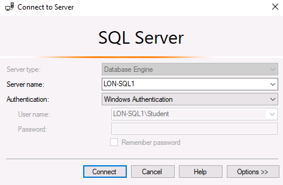
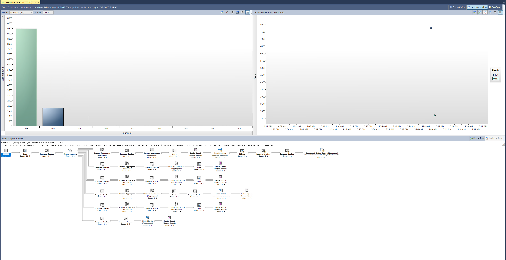

---
lab:
  title: ラボ 5 - クエリ パフォーマンスの問題解決
  module: Optimize Query Performance
---


# <a name="lab-5--query-performance-troubleshooting"></a>ラボ 5 - クエリ パフォーマンスの問題解決

**推定時間**:75 分

**ラボ ファイル**：このラボのファイルは、D:\Labfiles\Query Performance フォルダーにあります。


# <a name="lab-overview"></a>ラボの概要

The students will evaluate a database design for problems with normalization, data type selection and index design. They will run queries with suboptimal performance, examine the query plans, and attempt to make improvements within the AdventureWorks2017 database.

# <a name="lab-objectives"></a>ラボの目的

このラボを完了すると、次のことができるようになります。

1. データベース設計の問題を特定する

    - データベース設計のクエリを評価します

    - 既存の設計を調べて、過大または過小な正規化や不適切なデータ型などの潜在的な不良パターンがないか確認します 

2. パフォーマンスが悪いクエリの問題点を特定します 

    - GUI を使用せずにクエリを実行して実際の実行プランを生成します

    - 指定された実行プラン (キー検索など) を評価します 

3. クエリ ストアを使用して機能低下を検出して処理します 

    - ワークロードを実行して、クエリ ストアのクエリ統計を生成します 

    - リソース消費量上位のクエリを調べて低いパフォーマンスを特定する 

    - より適切な実行プランを強制する 

4. クエリ ヒントを使用してパフォーマンスに影響を与えます 

    - ワークロードを実行します 

    - パラメーター値を使用するようにクエリを変更します

    - クエリ ヒントをクエリに適用して値を最適化します 

# <a name="scenario"></a>シナリオ

You have been hired as a Senior Database Administrator to help with performance issues currently happening when users query the AdventureWorks2017 database. Your job is to identify issues in query performance and remedy them using techniques learned in this module.

最初のステップは、ユーザーが問題を抱えているクエリを確認し、推奨事項を作成することです。

1. AdventureWorks2017 内のデータベース設計の問題を特定します

2. AdventureWorks2017 のパフォーマンスの低いクエリの問題領域を特定します

3. クエリ ストアを使用して、AdventureWorks2017 で機能低下を検出して処理します

4. クエリ ヒントを使用して、AdventureWorks2017 のパフォーマンスに影響を与えます
 
        

<bpt id="p1">**</bpt>Note:<ept id="p1">**</ept> The exercises ask you to copy and paste T-SQL code. Please verify that the code has been copied correctly, with the proper line breaks, before executing the code. 

       


# <a name="exercise-1-identify-issues-with-database-design-in-adventureworks2017"></a>演習 1:AdventureWorks2017 のデータベース設計の問題を特定します

予測される所要時間:15 分

この演習の主なタスクは、以下の通りです。

1. クエリを調べて、警告が表示される理由とその警告の内容を特定します。

2. 問題を解決する方法が 2 つ見つかります。

    - クエリを修正して問題を解決します。

    - データベースの設計変更を提案して、問題を修正します。

## <a name="task-1-examine-the-query-and-identify-the-problem"></a>タスク 1:クエリを調べて問題を特定します。

1. ラボの仮想マシンで **SQL Server Management Studio (SSMS)** を起動します。 

    

2. SQL Server に接続するように求められます。  
サーバー名 LON-SQL1 を入力し、Windows 認証が選択されていることを確認して、[接続] をクリックします。

    

‎   
3. Open a new query window. Copy and paste the code below into your query window.

```sql
USE AdventureWorks2017;

SELECT BusinessEntityID, NationalIDNumber, LoginID, HireDate, JobTitle 

FROM HumanResources.Employee 

WHERE NationalIDNumber = 14417807;
```

4. Click on Include Actual Execution Plan icon as shown below before running the query or type CTRL+M. This will cause the execution plan to be displayed when you execute the query.
    <ph id="ph1"></ph>  
‎

5. [実行] ボタンをクリックしてこのクエリを実行します。 

6. Navigate to the execution plan, by clicking on Execution plan tab in the results panel in SSMS. In the execution plan, move your mouse over the SELECT operator. You will note a warning message identified by an exclamation point in a yellow triangle as shown below. Identify what the Warning Message tells you. 
    <ph id="ph1"></ph>

    暗黙的な変換がパフォーマンスの問題を引き起こしています。


## <a name="task-2-identify-two-ways-to-fix-the-warning-issue"></a>タスク 2:警告の問題を解決する 2 つの方法を識別する

テーブルの構造は、次のデータ定義言語 (DDL) ステートメントに示されています。

```sql
CREATE TABLE [HumanResources].[Employee](

 [BusinessEntityID] [int] NOT NULL,

 [NationalIDNumber] [nvarchar](15) NOT NULL,

 [LoginID] [nvarchar](256) NOT NULL,

 [OrganizationNode] [hierarchyid] NULL,

 [OrganizationLevel] AS ([OrganizationNode].[GetLevel]()),

 [JobTitle] [nvarchar](50) NOT NULL,

 [BirthDate] [date] NOT NULL,

 [MaritalStatus] [nchar](1) NOT NULL,

 [Gender] [nchar](1) NOT NULL,

 [HireDate] [date] NOT NULL,

 [SalariedFlag] [dbo].[Flag] NOT NULL,

 [VacationHours] [smallint] NOT NULL,

 [SickLeaveHours] [smallint] NOT NULL,

 [CurrentFlag] [dbo].[Flag] NOT NULL,

 [rowguid] [uniqueidentifier] ROWGUIDCOL NOT NULL,

 [ModifiedDate] [datetime] NOT NULL

) ON [PRIMARY]
```


1. コードをソリューションとして使用してクエリを修正します。

暗黙的な変換を引き起こしている列とその理由を特定します。 

受講生は、正規化、データ型の選択、およびインデックス設計の問題について、データベース設計を評価します。

2. 準最適なパフォーマンスでクエリを実行し、クエリ プランを調べ、AdventureWorks2017 データベース内で改善を試みます。

By changing the WHERE clause so that the value compared to the NationalIDNumber column matches the column’s data type in the table, you can get rid of the implicit conversion. In this scenario just adding a single quote on each side of the value changes it from a number to a character string. Keep the query window open for this query.

```sql
SELECT BusinessEntityID, NationalIDNumber, LoginID, HireDate, JobTitle 

FROM HumanResources.Employee 

WHERE NationalIDNumber = '14417807'
```


3. データベースの設計の変更を使用してクエリを修正します。 

To attempt to fix the index, open a new query window, and copy the query below to change the column’s data type. Attempt to execute the query by clicking Execute.

```sql
ALTER TABLE [HumanResources].[Employee] ALTER COLUMN [NationalIDNumber] INT NOT NULL;
```

The changes to the table would solve the conversion issue. However this change introduces another issue that as a database administrator you need to resolve. Since this column is part of an already existing nonclustered index, the index has to be rebuilt/recreated in order to execute the data type change. This could lead to extended downtime in production, which highlights the importance of choosing the right data types in your design. 

Msg 5074, Level 16, State 1, Line 1The index 'AK_Employee_NationalIDNumber' is dependent on column 'NationalIDNumber'.

Msg 4922, Level 16, State 9, Line 1

1 つ以上のオブジェクトがこの列にアクセスするので、ALTER TABLE ALTER COLUMN NationalIDNumber は失敗しました。

 

4. この問題を解決するには、以下のコードをコピーしてクエリ ウィンドウに貼り付け、[実行] をクリックして実行します。

```sql
USE AdventureWorks2017
GO

DROP INDEX [AK_Employee_NationalIDNumber] ON [HumanResources].[Employee]
GO

ALTER TABLE [HumanResources].[Employee] ALTER COLUMN [NationalIDNumber] INT NOT NULL;
GO

CREATE UNIQUE NONCLUSTERED INDEX [AK_Employee_NationalIDNumber] ON [HumanResources].[Employee]

( [NationalIDNumber] ASC

);
GO
```

5. 引用符のない元のクエリを再実行します。

```sql
USE AdventureWorks2017;

SELECT BusinessEntityID, NationalIDNumber, LoginID, HireDate, JobTitle 

FROM HumanResources.Employee 

WHERE NationalIDNumber = 14417807;
```

実行プランに警告メッセージが表示されなくなったことに注意してください。 

# <a name="exercise-2-isolate-problem-areas-in-poorly-performing-queries-in-adventureworks2017"></a>演習 2:AdventureWorks2017 でパフォーマンスの低いクエリの問題領域を特定します

予測される所要時間:30 分

この演習のタスクは次のとおりです。

1. クエリを実行して実際の実行プランを生成します。 

2. 指定された実行プラン (キー検索など) を評価します。 

## <a name="task-1-run-a-query-to-generate-the-actual-execution-plan"></a>タスク 1:クエリを実行して実際の実行プランを生成します

There are several ways to generate an execution plan in SQL Server Management Studio. You will use the same query from Exercise 1. Copy and paste the code below into a new query window and execute it by clicking Execute.

SHOWPLAN_ALL 設定を使用して、前回の演習で行ったのと同じ情報を、グラフィカルな結果ではなく [結果] ペインで取得できます。

```sql
USE AdventureWorks2017; 

GO 

SET SHOWPLAN_ALL ON; 

GO 

SELECT BusinessEntityID 

FROM HumanResources.Employee 

WHERE NationalIDNumber = '14417807'; 

GO 

SET SHOWPLAN_ALL OFF; 

GO 
```

テキスト版の実行プランが表示されます。

  
‎

## <a name="task-2-resolve-a-performance-problem-from-an-execution-plan"></a>タスク 2:実行プランからパフォーマンスの問題を解決する

1. Copy and paste the code below into a new query window. Click on Include Actual Execution Plan icon before running the query, or type CTRL+M. Execute the query by clicking Execute. Make note of the execution plan and the logical reads in the messages tab.

```sql
SET STATISTICS IO, TIME ON;

SELECT SalesOrderID, CarrierTrackingNumber, OrderQty, ProductID, UnitPrice, ModifiedDate

FROM AdventureWorks2017.Sales.SalesOrderDetail WHERE ModifiedDate > '2012/05/01' AND ProductID = 772;
```

When reviewing the execution plan you will note there is a key lookup. If you move your mouse over the icon, you will see that the properties indicate it is performed for each row retrieved by the query. You can see the execution plan is performing a Key Lookup operation. 

To identify what index needs to be altered in order to remove the key lookup, you need to examine the index seek above it. Hover over the index seek operator with your mouse and the properties of the operator will appear. Make note of the output list as shown below. 


2. Fix the Key Lookup and rerun the query to see the new plan. Key Lookups are fixed by adding a COVERING index that INCLUDES all columns being returned or searched in the query. In this example the index only had <bpt id="p1">**</bpt>ProductID<ept id="p1">**</ept>. If we add the output list columns to the index as included columns, and add the other search column (<bpt id="p1">**</bpt>ModifiedDate<ept id="p1">**</ept>) as a key column, then the Key Lookup will be removed. Since the index already exists you either have to DROP the index and recreate it or set DROP_EXISTING=ON in order to add the columns. Note <bpt id="p1">**</bpt>ProductID<ept id="p1">**</ept> is already part of the index and does not need to be added as an included column.

```sql
CREATE NONCLUSTERED INDEX IX_SalesOrderDetail_ProductID

ON [Sales].[SalesOrderDetail] (ProductID, ModifiedDate)

INCLUDE (CarrierTrackingNumber,OrderQty, UnitPrice)

WITH (DROP_EXISTING = ON);

GO
```

3. Rerun the query from Step 1. Make note of the changes to the logical reads and execution plan changes

# <a name="exercise-3-use-query-store-to-detect-and-handle-regression-in-adventureworks2017"></a>演習 3:クエリ ストアを使用して、AdventureWorks2017 の機能低下を検出して処理します。

予測される所要時間:15 分

このエクササイズのタスクは次のとおりです。

1. ワークロードを実行して QS のクエリ統計を生成します 

2. リソース消費量上位のクエリを調べて低いパフォーマンスを特定する 

3. より良い実行計画を強制します。 

## <a name="task-1-run-a-workload-to-generate-query-stats-for-query-store"></a>タスク 1:ワークロードを実行してクエリ ストアのクエリ統計を生成する

1. Copy and paste the code below into a new query window and execute it by clicking Execute. Make note of the execution plan and the logical reads in the messages tab. This script will enable the Query Store for AdventureWorks2017 and sets the database to Compatibility Level 100

```sql
USE master;
GO

ALTER DATABASE AdventureWorks2017 SET QUERY_STORE = ON;
GO

ALTER DATABASE AdventureWorks2017 SET QUERY_STORE (OPERATION_MODE = READ_WRITE);
GO

ALTER DATABASE AdventureWorks2017 SET COMPATIBILITY_LEVEL = 100;
GO
```


2. From the menu in SQL Server Management Studio, select File &gt; Open &gt; File. Navigate to the D:\Labfiles\Query Performance\CreateRandomWorkloadGenerator.sql file. Click on the file to load it into Management Studio and then click Execute to execute the query.


 
3. Run a workload to generate statistics for Query Store. Navigate to the D:\Labfiles\Query Performance\ExecuteRandomWorkload.sql script to execute a workload. Click execute to run the script. After execution completes, run the script a second time to generate more data. Leave the query tab open for this query.

4. Copy and paste the code below into a new query window and execute it by clicking Execute. This script changes the database compatibility mode using the below script to SQL Server 2019 (150).

```sql
USE master;
GO

ALTER DATABASE AdventureWorks2017 SET COMPATIBILITY_LEVEL = 150;
GO
```

5. 手順 3 (ExecuteRandomWorkload.sql) のクエリ タブに戻り、もう一度実行します。

## <a name="task-2-examine-top-resource-consuming-queries-to-identify-poor-performance"></a>タスク 2:リソース消費量上位のクエリを調べて低いパフォーマンスを特定する

1. In order to view the Query Store you will need to refresh the AdventureWorks2017 database in Management Studio. Make sure that Management Studio is connected to the local SQL Server instance. Right click on database name and choose click refresh. You will then see the Query Store option under the database.  
‎   
   ‎

2. Expand Query Store node to view all available reports. Click on plus sign to expand Query Store reports. Select the Top Resource Consuming Queries Report by double-clicking on it.

    

    次に示すようなレポートが開きます。  
    ‎ 
    
    Make sure that SQL Server Management Studio is maximized in size. Click configure in the top right. 

    

    In the configuration screen, change the filter for the minimum number of query plans to 2. Click Apply and close the configuration window.

    

 

3. レポートの左上にある横棒グラフの左端のバーをクリックして、最も長い期間のクエリを選択します。

      
‎


    これにより、クエリ ストア内の最長クエリのクエリとプランの概要が表示されます。 

    

## <a name="task-3-force-a-better-execution-plan"></a>タスク 3:より適切な実行プランを強制する

1. Navigate to the plan summary portion of the report as shown below. You will note there are two execution plans with widely different durations.

      
‎

2. あなたは、ユーザーが AdventureWorks2017 データベースに対してクエリを実行するときに現在発生しているパフォーマンスの問題に対処するために、シニア データベース管理者として採用されました。

3. あなたの仕事は、このモジュールで学習した手法を使用して、クエリのパフォーマンスの問題を明らかにし、解決することです。

       
‎

    強制すると、強制されたプランがグレーで表示されるようになり、プラン概要ウィンドウのプランに強制されたことを示すチェック マークが表示されます。

    
    
    
4. すべてのクエリ ウィンドウとクエリ ストア レポートを閉じます。
    

# <a name="exercise-4-use-query-hints-to-impact-performance-in-adventureworks2017"></a>演習 4:クエリ ヒントを使用して AdventureWorks2017 のパフォーマンスに影響を与える

予測される所要時間:15 分

この演習の主なタスクは、以下の通りです。

1. ワークロードを実行します。 

2. クエリを変更してパラメーターを使用します

3. クエリ ヒントをクエリに適用して値を最適化し、もう一度実行します。

## <a name="task-1-run-a-workload"></a>タスク 1:ワークロードを実行する

1. Open a New Query window in SQL Server Management Studio. Click on Include Actual Execution Plan icon before running the query or use CTRL+M.
    
      
‎
2. Execute the query below. Note that the execution plan shows an index seek operator.
        
    ```sql
    USE AdventureWorks2017

    GO

    SELECT SalesOrderId, OrderDate

    FROM Sales.SalesOrderHeader 

    WHERE SalesPersonID=288;
    ```
 
    

3. Now run the next query. The only change is that the SalesPersonID value being searched for is 277. Note the Clustered Index Scan operation in the execution plan.

    ```sql
    USE [AdventureWorks2017]

    GO

    SELECT SalesOrderId, OrderDate

    FROM Sales.SalesOrderHeader

    WHERE SalesPersonID=277;
    ```

    

    Based on the column statistics the query optimizer has chosen a different execution plan because of the different value used in the WHERE clause. Because this query uses a constant in its WHERE clause, the optimizer sees each of these queries as unique and generates a different execution plan for each one.

## <a name="task-2-change-the-query-to-use-a-parameterized-stored-procedure-and-use-a-query-hint"></a>タスク 2:クエリを変更してパラメーター化されたストアド プロシージャを使用し、クエリ ヒントを使用します

1. Open a New Query window. Click on Include Actual Execution Plan or use CTRL+M.

2. Create a parameterized stored procedure so that the value to be searched for can be passed as a parameter instead of a hard-coded value in the WHERE clause. You should ensure that the data type of your parameter matches the data type of the column in the target table. Copy and execute the code below. 

    ```sql
    USE AdventureWorks2017  
    GO 
    
    CREATE OR ALTER PROCEDURE getSalesOrder  
    @PersonID INT 
    AS 
    SELECT SalesOrderId, OrderDate 
    FROM Sales.SalesOrderHeader 
    WHERE SalesPersonID = @PersonID 
    GO
    
    ```

3. **注:**  演習では、T-SQL コードをコピーして貼り付けるように求められます。 

    ```sql
    EXEC getSalesOrder 277 
    GO  
    ```

    前に説明したように、パラメーター化されていない SELECT ステートメントを実行して値 277 を検索する場合、プランはクラスター化インデックス スキャンの使用を示します。 
    
4. コードを実行する前に、コードが正しくコピーされ、改行されていることを確認してください。 

    ```sql
    EXEC getSalesOrder 288 
    GO  
    ``` 

    If you examine the execution plan, you will note it is the same as it was for the value of 277. This is because SQL Server has cached the execution plan and is reusing it for the second execution of the procedure. Note that although the same plan is used for both queries, it is not necessarily the best plan.

5. 次のコマンドを実行して、AdventureWorks2017 データベースのプラン キャッシュをクリアします。

    ```sql
    USE AdventureWorks2017  
    GO 
    ALTER DATABASE SCOPED CONFIGURATION CLEAR PROCEDURE_CACHE;  
    GO
    ```

6. Run the procedure again with a parameter value of 288. Copy and execute the following code: 

    ```sql
    EXEC getSalesOrder 288 
    GO  
    ``` 

    You should notice the plan is now using the Nonclustered Index Seek operation.  This is because the cached plan was removed and a new plan was created based on the new initial parameter value of 288. 
 
7. Now recreate the stored procedure with a Query Hint. Because of the OPTION hint, the optimizer will create a plan based on a value of 288 and that plan will be used no matter what parameter value is passed to the procedure. 

    Execute the procedure multiple times and note that it now always uses the plan with the Nonclustered Index Seek. Try calling with the procedure with parameter values we haven't seen yet, and you'll notice that no matter how many rows are returned (or no rows are returned!) the plan will always use the Nonclustered Index Seek. 

    ```sql
    USE AdventureWorks2017  
    GO 
    
    CREATE OR ALTER PROCEDURE getSalesOrder  
    @PersonID INT 
    AS 
    SELECT SalesOrderId, OrderDate  
    FROM Sales.SalesOrderHeader   
    WHERE SalesPersonID = @PersonID  
    OPTION (OPTIMIZE FOR (@PersonID = 288));  
    GO    
    
    EXEC getSalesOrder 288; 
    GO  
    
    EXEC getSalesOrder 277; 
    GO 
    
    EXEC getSalesOrder 200;
    GO 
    ``` 

8. すべてのクエリ ウィンドウを閉じます。 
